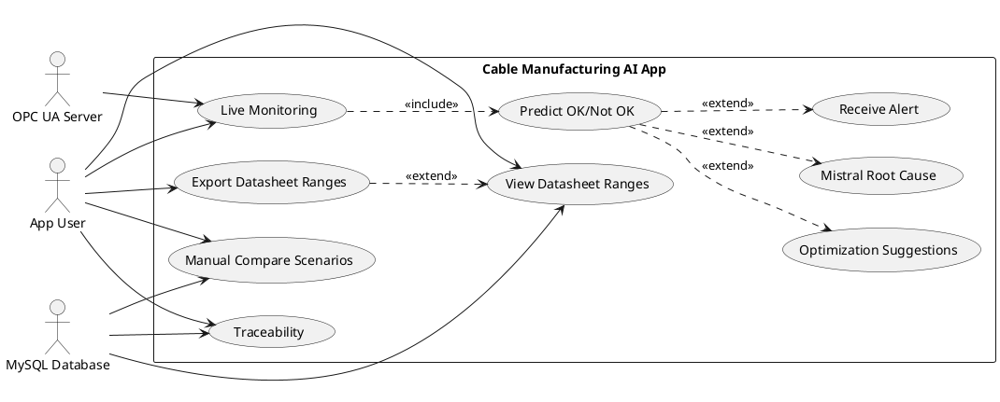
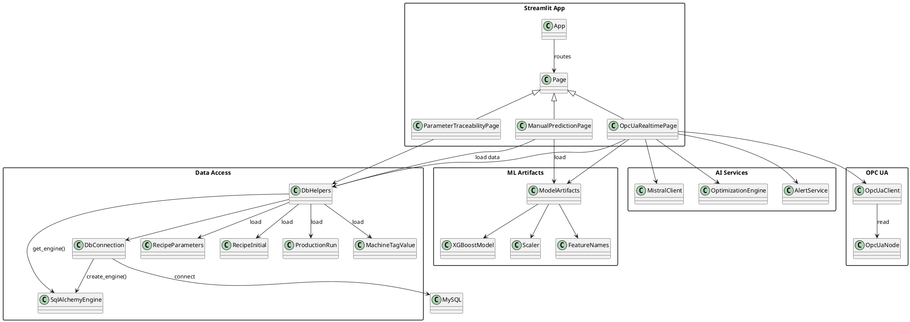

# General UML Diagrams

This file contains general PlantUML diagrams derived from the current Streamlit app structure.

## Use Case Diagram (General)

```plantuml
@startuml
left to right direction
skinparam packageStyle rectangle

actor "App User" as User
actor "OPC UA Server" as OpcServer
actor "MySQL Database" as MySql

rectangle "Cable Manufacturing AI App" {
  usecase "View Datasheet Ranges" as UC_ViewRanges
  usecase "Export Datasheet Ranges" as UC_ExportRanges
  usecase "Manual Compare Scenarios" as UC_ManualCompare
  usecase "Live Monitoring" as UC_Live
  usecase "Predict OK/Not OK" as UC_PredictStatus
  usecase "Optimization Suggestions" as UC_Optimize
  usecase "Mistral Root Cause" as UC_RootCause
  usecase "Receive Alert" as UC_Alert
  usecase "Traceability" as UC_Trace
}

User --> UC_ViewRanges
User --> UC_ExportRanges
User --> UC_ManualCompare
User --> UC_Live
User --> UC_Trace

OpcServer --> UC_Live
MySql --> UC_ViewRanges
MySql --> UC_ManualCompare
MySql --> UC_Trace

UC_ExportRanges ..> UC_ViewRanges : <<extend>>
UC_Live ..> UC_PredictStatus : <<include>>
UC_PredictStatus ..> UC_Optimize : <<extend>>
UC_PredictStatus ..> UC_RootCause : <<extend>>
UC_PredictStatus ..> UC_Alert : <<extend>>
@enduml
```

## Class Diagram (General)

```plantuml
@startuml
skinparam classAttributeIconSize 0
skinparam packageStyle rectangle

package "Streamlit App" {
  class App
  class Page
  class ManualPredictionPage
  class OpcUaRealtimePage
  class ParameterTraceabilityPage

  App --> Page : routes
  Page <|-- ManualPredictionPage
  Page <|-- OpcUaRealtimePage
  Page <|-- ParameterTraceabilityPage
}

package "Data Access" {
  class DbHelpers
  class DbConnection
  class SqlAlchemyEngine
  class RecipeParameters
  class RecipeInitial
  class ProductionRun
  class MachineTagValue

  DbHelpers --> SqlAlchemyEngine : get_engine()
  DbHelpers --> RecipeParameters : load
  DbHelpers --> RecipeInitial : load
  DbHelpers --> ProductionRun : load
  DbHelpers --> MachineTagValue : load
  DbConnection --> SqlAlchemyEngine : create_engine()
}

package "ML Artifacts" {
  class ModelArtifacts
  class XGBoostModel
  class Scaler
  class FeatureNames
  ModelArtifacts --> XGBoostModel
  ModelArtifacts --> Scaler
  ModelArtifacts --> FeatureNames
}

package "AI Services" {
  class MistralClient
  class OptimizationEngine
  class AlertService
}

package "OPC UA" {
  class OpcUaClient
  class OpcUaNode

  OpcUaClient --> OpcUaNode : read
}

ManualPredictionPage --> DbHelpers : load data
ManualPredictionPage --> ModelArtifacts : load
OpcUaRealtimePage --> DbHelpers
OpcUaRealtimePage --> ModelArtifacts
OpcUaRealtimePage --> MistralClient
OpcUaRealtimePage --> OptimizationEngine
OpcUaRealtimePage --> AlertService
OpcUaRealtimePage --> OpcUaClient
ParameterTraceabilityPage --> DbHelpers

DbHelpers --> DbConnection
DbConnection --> "MySQL" : connect
@enduml
```
