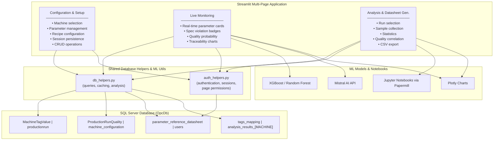

# Figure 1.2 — System Architecture Diagram

> Modular Streamlit multi-page architecture organized around configuration, live monitoring, and analysis — backed by SQL Server, ML models, and Mistral AI.

**Data Flow:**

1. OPC UA sensors write data to `MachineTagValue` (time-series events)
2. Configuration page saves machine setups to `machine_configuration`
3. Analysis notebook (executed via Papermill) reads historical data, computes statistics, and stores reference datasheets
4. Model page loads reference datasheets and compares live values from `MachineTagValue` in real-time
5. Quality prediction score is computed based on parameter deviations from specification ranges
6. Out-of-spec parameters trigger Mistral AI for natural-language root-cause analysis
7. `auth_helpers.py` enforces page-level permissions on every page load
