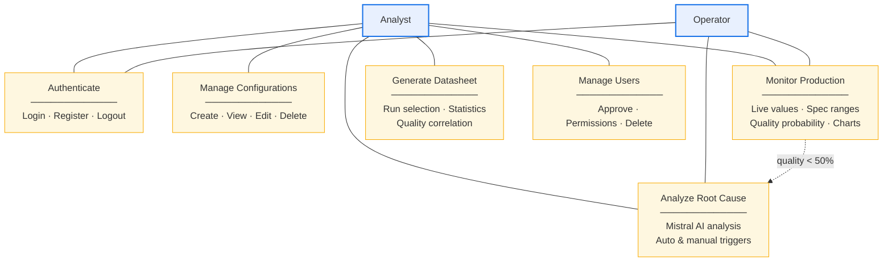

# Figure 2.1 — General Use Case Diagram

High-level system overview showing Analyst and Operator interactions with core functionalities.

```mermaid
flowchart TD
    ANL[Analyst]
    OPR[Operator]

    AUTH["Authenticate
        ─────────────
        Login · Register · Logout"]
    CFG["Manage Configurations
        ─────────────
        Create · View · Edit · Delete"]
    MON["Monitor Production
        ─────────────
        Live values · Spec ranges
        Quality probability · Charts"]
    DS["Generate Datasheet
        ─────────────
        Run selection · Statistics
        Quality correlation"]
    RCA["Analyze Root Cause
        ─────────────
        Mistral AI analysis
        Auto & manual triggers"]
    USR["Manage Users
        ─────────────
        Approve · Permissions · Delete"]

    ANL --- AUTH & CFG & MON & DS & RCA & USR
    OPR --- AUTH & MON & RCA

    MON -.->|quality < 50%| RCA

    classDef actor fill:#e8f0fe,stroke:#1a73e8,stroke-width:2px;
    classDef uc fill:#fef7e0,stroke:#f9ab00,stroke-width:1px;
    class ANL,OPR actor;
    class AUTH,CFG,MON,DS,RCA,USR uc;
```
