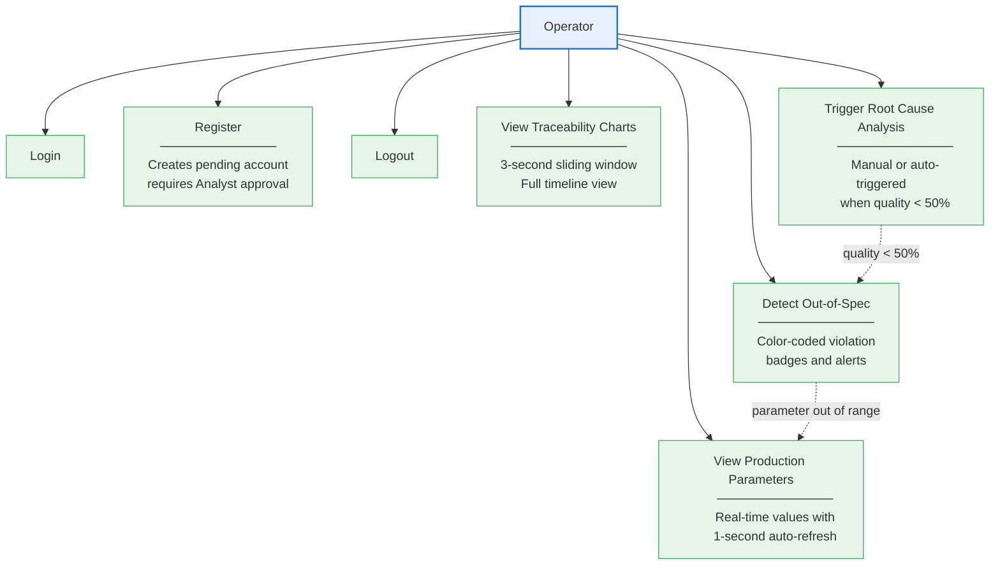

# Figure 2.2 — Operator Use Case Diagram

Operator-focused view showing the restricted but critical monitoring capabilities available to the Operator role.

```mermaid
flowchart TD
    OPR[Operator]

    LOGIN["Login"]
    REGISTER["Register
        ─────────────
        Creates pending account
        requires Analyst approval"]
    LOGOUT["Logout"]
    VIEW_PARAM["View Production Parameters
        ─────────────
        Real-time values with
        1-second auto-refresh"]
    DETECT["Detect Out-of-Spec
        ─────────────
        Color-coded violation
        badges and alerts"]
    CHARTS["View Traceability Charts
        ─────────────
        3-second sliding window
        Full timeline view"]
    RCA["Trigger Root Cause Analysis
        ─────────────
        Manual or auto-triggered
        when quality < 50%"]

    OPR --> LOGIN & REGISTER & LOGOUT
    OPR --> VIEW_PARAM & DETECT & CHARTS & RCA

    DETECT -.->|parameter out of range| VIEW_PARAM
    RCA -.->|quality < 50%| DETECT

    classDef actor fill:#e8f0fe,stroke:#1a73e8,stroke-width:2px;
    classDef uc fill:#e6f4ea,stroke:#34a853,stroke-width:1px;
    class OPR actor;
    class LOGIN,REGISTER,LOGOUT,VIEW_PARAM,DETECT,CHARTS,RCA uc;
```
