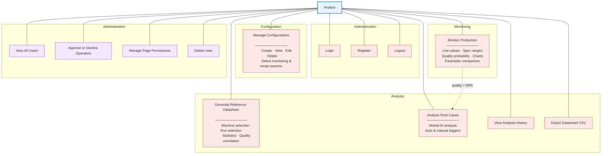

# Figure 2.3 — Analyst Use Case Diagram

Full range of Analyst capabilities across all system modules.

```mermaid
flowchart TD
    ANL[Analyst]

    subgraph Auth["Authentication"]
        LOGIN["Login"]
        REGISTER["Register"]
        LOGOUT["Logout"]
    end

    subgraph Config["Configuration"]
        CFG["Manage Configurations
            ─────────────
            Create · View · Edit · Delete
            Select monitoring & recipe params"]
    end

    subgraph Monitor["Monitoring"]
        MON["Monitor Production
            ─────────────
            Live values · Spec ranges
            Quality probability · Charts
            Parameter comparison"]
    end

    subgraph Analysis["Analysis"]
        DS["Generate Reference Datasheet
            ─────────────
            Machine selection · Run selection
            Statistics · Quality correlation"]
        RCA["Analyze Root Cause
            ─────────────
            Mistral AI analysis
            Auto & manual triggers"]
        HIST["View Analysis History"]
        EXPORT["Export Datasheet CSV"]
    end

    subgraph Admin["Administration"]
        USERS["View All Users"]
        APPROVE["Approve or Decline Operators"]
        PERMS["Manage Page Permissions"]
        DELETE["Delete User"]
    end

    ANL --- LOGIN & REGISTER & LOGOUT
    ANL --- CFG
    ANL --- MON
    ANL --- DS & RCA & HIST & EXPORT
    ANL --- USERS & APPROVE & PERMS & DELETE

    MON -.->|quality < 50%| RCA

    classDef actor fill:#e8f0fe,stroke:#1a73e8,stroke-width:2px;
    classDef uc fill:#fce8e6,stroke:#ea4335,stroke-width:1px;
    classDef admin fill:#f3e8fd,stroke:#9334ea,stroke-width:1px;
    class ANL actor;
    class LOGIN,REGISTER,LOGOUT uc;
    class CFG uc;
    class MON uc;
    class DS,RCA,HIST,EXPORT uc;
    class USERS,APPROVE,PERMS,DELETE admin;
```
