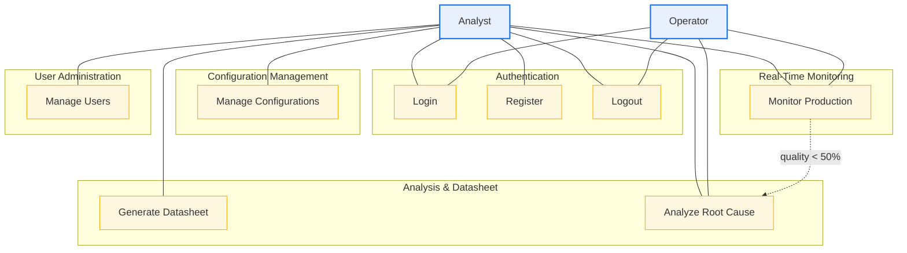

# Figure 3.1 — System Use Case Diagram (Main)

Conception-level diagram with subsystem grouping showing Analyst and Operator role access.

```mermaid
flowchart TD
    ANL[Analyst]
    OPR[Operator]

    subgraph Auth["Authentication"]
        A_LOGIN[Login]
        A_REG[Register]
        A_LOGOUT[Logout]
    end

    subgraph Config["Configuration Management"]
        C_MGMT[Manage Configurations]
    end

    subgraph Monitor["Real-Time Monitoring"]
        M_MON[Monitor Production]
    end

    subgraph Analysis["Analysis & Datasheet"]
        A_DS[Generate Datasheet]
        A_RCA[Analyze Root Cause]
    end

    subgraph Admin["User Administration"]
        AD_USERS[Manage Users]
    end

    ANL --- A_LOGIN & A_REG & A_LOGOUT
    ANL --- C_MGMT
    ANL --- M_MON
    ANL --- A_DS & A_RCA
    ANL --- AD_USERS

    OPR --- A_LOGIN & A_LOGOUT
    OPR --- M_MON
    OPR --- A_RCA

    M_MON -.->|quality < 50%| A_RCA

    classDef actor fill:#e8f0fe,stroke:#1a73e8,stroke-width:2px;
    classDef uc fill:#fef7e0,stroke:#f9ab00,stroke-width:1px;
    class ANL,OPR actor;
    class A_LOGIN,A_REG,A_LOGOUT,C_MGMT,M_MON,A_DS,A_RCA,AD_USERS uc;
```
