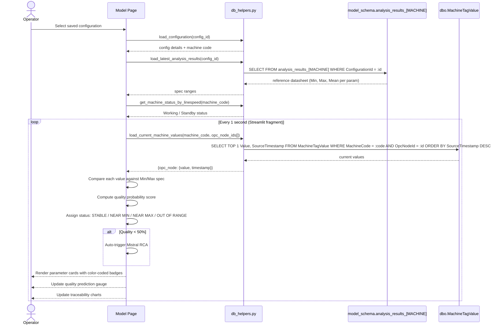

# Figure 3.10 — Real-Time Monitoring Sequence Diagram

> Operator selects a configuration and views live parameter values with specification comparison, auto-refreshing every second.

```mermaid
sequenceDiagram
    actor O as Operator
    participant ModelPage as Model Page
    participant DBHelpers as db_helpers.py
    participant AR as model_schema.analysis_results_[MACHINE]
    participant MTV as dbo.MachineTagValue

    O->>ModelPage: Select saved configuration
    ModelPage->>DBHelpers: load_configuration(config_id)
    DBHelpers-->>ModelPage: config details + machine code

    ModelPage->>DBHelpers: load_latest_analysis_results(config_id)
    DBHelpers->>AR: SELECT FROM analysis_results_[MACHINE] WHERE ConfigurationId = :id
    AR-->>DBHelpers: reference datasheet (Min, Max, Mean per param)
    DBHelpers-->>ModelPage: spec ranges

    ModelPage->>DBHelpers: get_machine_status_by_linespeed(machine_code)
    DBHelpers-->>ModelPage: Working / Standby status

    loop Every 1 second (Streamlit fragment)
        ModelPage->>DBHelpers: load_current_machine_values(machine_code, opc_node_ids[])
        DBHelpers->>MTV: SELECT TOP 1 Value, SourceTimestamp FROM MachineTagValue WHERE MachineCode = :code AND OpcNodeId = :id ORDER BY SourceTimestamp DESC
        MTV-->>DBHelpers: current values
        DBHelpers-->>ModelPage: {opc_node: {value, timestamp}}

        ModelPage->>ModelPage: Compare each value against Min/Max spec
        ModelPage->>ModelPage: Compute quality probability score
        ModelPage->>ModelPage: Assign status: STABLE / NEAR MIN / NEAR MAX / OUT OF RANGE

        alt Quality < 50%
            ModelPage->>ModelPage: Auto-trigger Mistral RCA
        end

        ModelPage-->>O: Render parameter cards with color-coded badges
        ModelPage-->>O: Update quality prediction gauge
        ModelPage-->>O: Update traceability charts
    end
```
