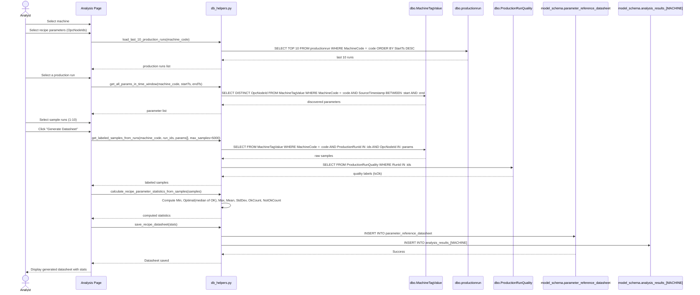

# Figure 3.11 — Datasheet Analysis Sequence Diagram

> Analyst selects machine, recipe parameters, and production runs to generate a statistical reference datasheet.

```mermaid
sequenceDiagram
    actor A as Analyst
    participant AnalysisPage as Analysis Page
    participant DBHelpers as db_helpers.py
    participant MTV as dbo.MachineTagValue
    participant PR as dbo.productionrun
    participant PRQ as dbo.ProductionRunQuality
    participant PRDS as model_schema.parameter_reference_datasheet
    participant AR as model_schema.analysis_results_[MACHINE]

    A->>AnalysisPage: Select machine
    A->>AnalysisPage: Select recipe parameters (OpcNodeIds)

    AnalysisPage->>DBHelpers: load_last_10_production_runs(machine_code)
    DBHelpers->>PR: SELECT TOP 10 FROM productionrun WHERE MachineCode = :code ORDER BY StartTs DESC
    PR-->>DBHelpers: last 10 runs
    DBHelpers-->>AnalysisPage: production runs list

    A->>AnalysisPage: Select a production run
    AnalysisPage->>DBHelpers: get_all_params_in_time_window(machine_code, startTs, endTs)
    DBHelpers->>MTV: SELECT DISTINCT OpcNodeId FROM MachineTagValue WHERE MachineCode = :code AND SourceTimestamp BETWEEN :start AND :end
    MTV-->>DBHelpers: discovered parameters
    DBHelpers-->>AnalysisPage: parameter list

    A->>AnalysisPage: Select sample runs (1-10)
    A->>AnalysisPage: Click "Generate Datasheet"

    AnalysisPage->>DBHelpers: get_labeled_samples_from_runs(machine_code, run_ids, params[], max_samples=5000)
    DBHelpers->>MTV: SELECT FROM MachineTagValue WHERE MachineCode = :code AND ProductionRunId IN :ids AND OpcNodeId IN :params
    MTV-->>DBHelpers: raw samples
    DBHelpers->>PRQ: SELECT FROM ProductionRunQuality WHERE RunId IN :ids
    PRQ-->>DBHelpers: quality labels (IsOk)
    DBHelpers-->>AnalysisPage: labeled samples

    AnalysisPage->>DBHelpers: calculate_recipe_parameter_statistics_from_samples(samples)
    DBHelpers->>DBHelpers: Compute Min, Optimal(median of OK), Max, Mean, StdDev, OkCount, NotOkCount
    DBHelpers-->>AnalysisPage: computed statistics

    AnalysisPage->>DBHelpers: save_recipe_datasheet(stats)
    DBHelpers->>PRDS: INSERT INTO parameter_reference_datasheet
    DBHelpers->>AR: INSERT INTO analysis_results_[MACHINE]
    PRDS-->>DBHelpers: Success
    DBHelpers-->>AnalysisPage: Datasheet saved

    AnalysisPage-->>A: Display generated datasheet with stats
```
