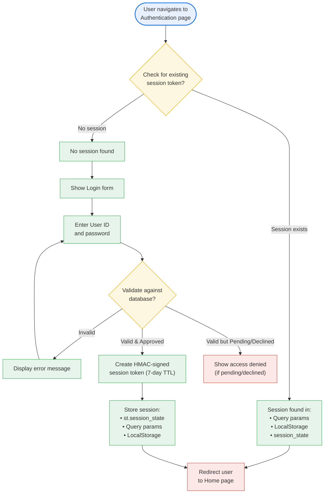

# Figure 3.13 — User Login Activity Diagram

> Workflow from navigation through session check, credential validation, and redirect.

```mermaid
flowchart TD
    START(["User navigates to
        Authentication page"])
    CHECK_SESSION{"Check for existing
        session token?"}
    HAS_SESSION["Session found in:
        • Query params
        • LocalStorage
        • session_state"]
    NO_SESSION["No session found"]
    SHOW_LOGIN["Show Login form"]
    ENTER_CRED["Enter User ID
        and password"]
    VALIDATE{"Validate against
        database?"}
    INVALID["Display error message"]
    CREATE_TOKEN["Create HMAC-signed
        session token (7-day TTL)"]
    STORE_SESSION["Store session:
        • st.session_state
        • Query params
        • LocalStorage"]
    REDIRECT["Redirect user
        to Home page"]
    ACCESS_DENIED["Show access denied
        (if pending/declined)"]

    START --> CHECK_SESSION
    CHECK_SESSION -->|Session exists| HAS_SESSION
    HAS_SESSION --> REDIRECT

    CHECK_SESSION -->|No session| NO_SESSION
    NO_SESSION --> SHOW_LOGIN
    SHOW_LOGIN --> ENTER_CRED
    ENTER_CRED --> VALIDATE

    VALIDATE -->|Invalid| INVALID
    INVALID --> ENTER_CRED

    VALIDATE -->|Valid & Approved| CREATE_TOKEN
    CREATE_TOKEN --> STORE_SESSION
    STORE_SESSION --> REDIRECT

    VALIDATE -->|Valid but Pending/Declined| ACCESS_DENIED

    classDef start fill:#e8f0fe,stroke:#1a73e8,stroke-width:2px;
    classDef decision fill:#fef7e0,stroke:#f9ab00,stroke-width:1px;
    classDef process fill:#e6f4ea,stroke:#34a853,stroke-width:1px;
    classDef term fill:#fce8e6,stroke:#ea4335,stroke-width:1px;
    class START start;
    class CHECK_SESSION,VALIDATE decision;
    class HAS_SESSION,NO_SESSION,SHOW_LOGIN,ENTER_CRED,CREATE_TOKEN,STORE_SESSION,INVALID process;
    class REDIRECT,ACCESS_DENIED term;
```
