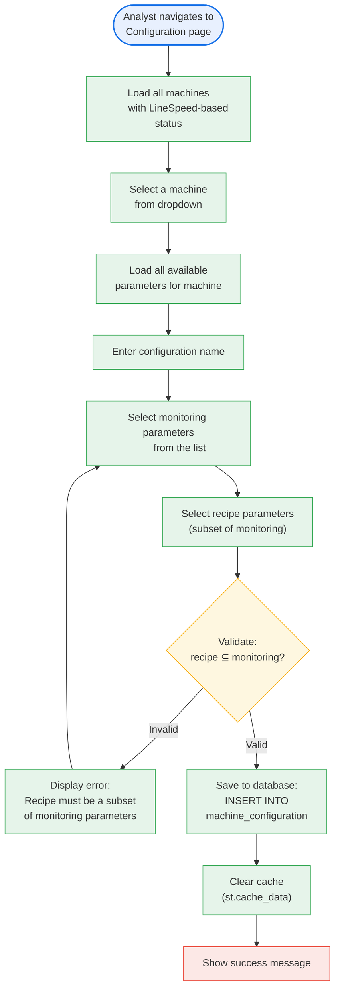

# Figure 3.15 — Machine Configuration Activity Diagram

> Analyst workflow for creating a new machine configuration with parameter and recipe selection.

```mermaid
flowchart TD
    START(["Analyst navigates to
        Configuration page"])
    LOAD_MACHINES["Load all machines
        with LineSpeed-based status"]
    SEL_MACHINE["Select a machine
        from dropdown"]
    LOAD_PARAMS["Load all available
        parameters for machine"]
    ENTER_NAME["Enter configuration name"]
    SEL_MONITORING["Select monitoring parameters
        from the list"]
    SEL_RECIPE["Select recipe parameters
        (subset of monitoring)"]
    VALIDATE{"Validate:
        recipe ⊆ monitoring?"}
    INVALID["Display error:
        Recipe must be a subset
        of monitoring parameters"]
    SAVE_DB["Save to database:
        INSERT INTO
        machine_configuration"]
    CLEAR_CACHE["Clear cache
        (st.cache_data)"]
    SUCCESS["Show success message"]

    START --> LOAD_MACHINES
    LOAD_MACHINES --> SEL_MACHINE
    SEL_MACHINE --> LOAD_PARAMS
    LOAD_PARAMS --> ENTER_NAME
    ENTER_NAME --> SEL_MONITORING
    SEL_MONITORING --> SEL_RECIPE
    SEL_RECIPE --> VALIDATE

    VALIDATE -->|Invalid| INVALID
    INVALID --> SEL_MONITORING

    VALIDATE -->|Valid| SAVE_DB
    SAVE_DB --> CLEAR_CACHE
    CLEAR_CACHE --> SUCCESS

    classDef start fill:#e8f0fe,stroke:#1a73e8,stroke-width:2px;
    classDef decision fill:#fef7e0,stroke:#f9ab00,stroke-width:1px;
    classDef process fill:#e6f4ea,stroke:#34a853,stroke-width:1px;
    classDef term fill:#fce8e6,stroke:#ea4335,stroke-width:1px;
    class START start;
    class VALIDATE decision;
    class LOAD_MACHINES,SEL_MACHINE,LOAD_PARAMS,ENTER_NAME,SEL_MONITORING,SEL_RECIPE,SAVE_DB,CLEAR_CACHE,INVALID process;
    class SUCCESS term;
```
