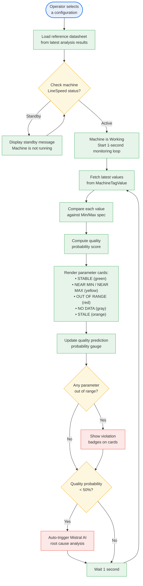

# Figure 3.16 — Real-Time Monitoring Activity Diagram

> Continuous monitoring loop: load configuration, check machine status, fetch and compare live values, render cards, and trigger root cause analysis on anomaly.

