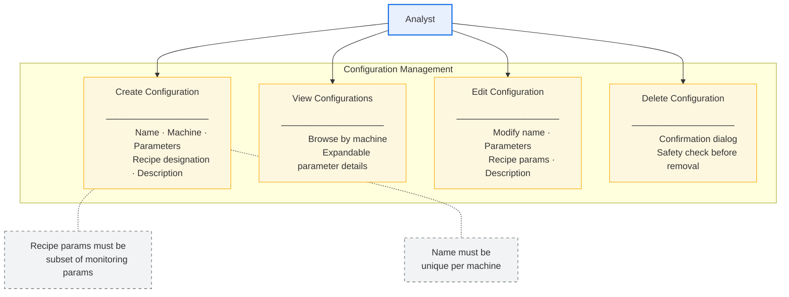

# Figure 3.2 — Configuration Management Use Case Diagram

Analyst performs CRUD operations on machine configurations with monitoring and recipe parameters.

```mermaid
flowchart TD
    ANL[Analyst]

    subgraph ConfigMgmt["Configuration Management"]
        CREATE["Create Configuration
            ────────────────
            Name · Machine · Parameters
            Recipe designation · Description"]
        VIEW["View Configurations
            ────────────────
            Browse by machine
            Expandable parameter details"]
        EDIT["Edit Configuration
            ────────────────
            Modify name · Parameters
            Recipe params · Description"]
        DELETE["Delete Configuration
            ────────────────
            Confirmation dialog
            Safety check before removal"]
    end

    ANL --> CREATE & VIEW & EDIT & DELETE

    CREATE -.- VALIDATE1["Recipe params must be
        subset of monitoring params"]
    CREATE -.- VALIDATE2["Name must be
        unique per machine"]

    classDef actor fill:#e8f0fe,stroke:#1a73e8,stroke-width:2px;
    classDef uc fill:#fef7e0,stroke:#f9ab00,stroke-width:1px;
    classDef rule fill:#f1f3f4,stroke:#5f6368,stroke-width:1px,stroke-dasharray: 5 5;
    class ANL actor;
    class CREATE,VIEW,EDIT,DELETE uc;
    class VALIDATE1,VALIDATE2 rule;
```
