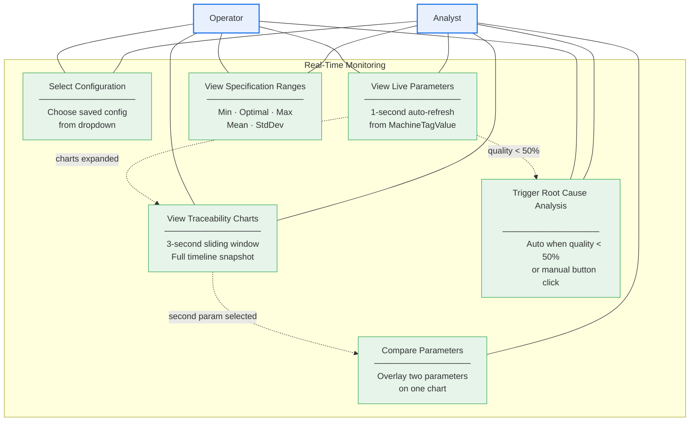

# Figure 3.3 — Real-Time Monitoring Use Case Diagram

Both roles can monitor live production data, view specification ranges, charts, and trigger root cause analysis.

```mermaid
flowchart TD
    ANL[Analyst]
    OPR[Operator]

    subgraph Monitor["Real-Time Monitoring"]
        SEL_CFG["Select Configuration
            ────────────────
            Choose saved config
            from dropdown"]
        LIVE["View Live Parameters
            ────────────────
            1-second auto-refresh
            from MachineTagValue"]
        SPEC["View Specification Ranges
            ────────────────
            Min · Optimal · Max
            Mean · StdDev"]
        CHARTS["View Traceability Charts
            ────────────────
            3-second sliding window
            Full timeline snapshot"]
        COMPARE["Compare Parameters
            ────────────────
            Overlay two parameters
            on one chart"]
        RCA["Trigger Root Cause Analysis
            ────────────────
            Auto when quality < 50%
            or manual button click"]
    end

    ANL --- SEL_CFG & LIVE & SPEC & CHARTS & COMPARE & RCA
    OPR --- SEL_CFG & LIVE & SPEC & CHARTS & RCA

    LIVE -.->|quality < 50%| RCA
    LIVE -.->|charts expanded| CHARTS
    CHARTS -.->|second param selected| COMPARE

    classDef actor fill:#e8f0fe,stroke:#1a73e8,stroke-width:2px;
    classDef uc fill:#e6f4ea,stroke:#34a853,stroke-width:1px;
    class ANL,OPR actor;
    class SEL_CFG,LIVE,SPEC,CHARTS,COMPARE,RCA uc;
```
