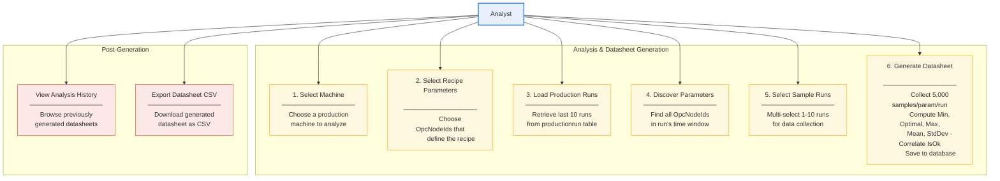

# Figure 3.4 — Analysis & Datasheet Generation Use Case Diagram

Analyst follows a sequential six-step workflow to generate statistical reference datasheets from historical production data.

```mermaid
flowchart TD
    ANL[Analyst]

    subgraph Analysis["Analysis & Datasheet Generation"]
        STEP1["1. Select Machine
            ────────────────
            Choose a production
            machine to analyze"]
        STEP2["2. Select Recipe Parameters
            ────────────────
            Choose OpcNodeIds that
            define the recipe"]
        STEP3["3. Load Production Runs
            ────────────────
            Retrieve last 10 runs
            from productionrun table"]
        STEP4["4. Discover Parameters
            ────────────────
            Find all OpcNodeIds
            in run's time window"]
        STEP5["5. Select Sample Runs
            ────────────────
            Multi-select 1-10 runs
            for data collection"]
        STEP6["6. Generate Datasheet
            ────────────────
            Collect 5,000 samples/param/run
            Compute Min, Optimal, Max,
            Mean, StdDev · Correlate IsOk
            Save to database"]
    end

    subgraph PostGen["Post-Generation"]
        HIST["View Analysis History
            ────────────────
            Browse previously
            generated datasheets"]
        CSV["Export Datasheet CSV
            ────────────────
            Download generated
            datasheet as CSV"]
    end

    ANL --> STEP1 & STEP2 & STEP3 & STEP4 & STEP5 & STEP6
    ANL --> HIST & CSV

    classDef actor fill:#e8f0fe,stroke:#1a73e8,stroke-width:2px;
    classDef step fill:#fef7e0,stroke:#f9ab00,stroke-width:1px;
    classDef uc fill:#fce8e6,stroke:#ea4335,stroke-width:1px;
    class ANL actor;
    class STEP1,STEP2,STEP3,STEP4,STEP5,STEP6 step;
    class HIST,CSV uc;
```
