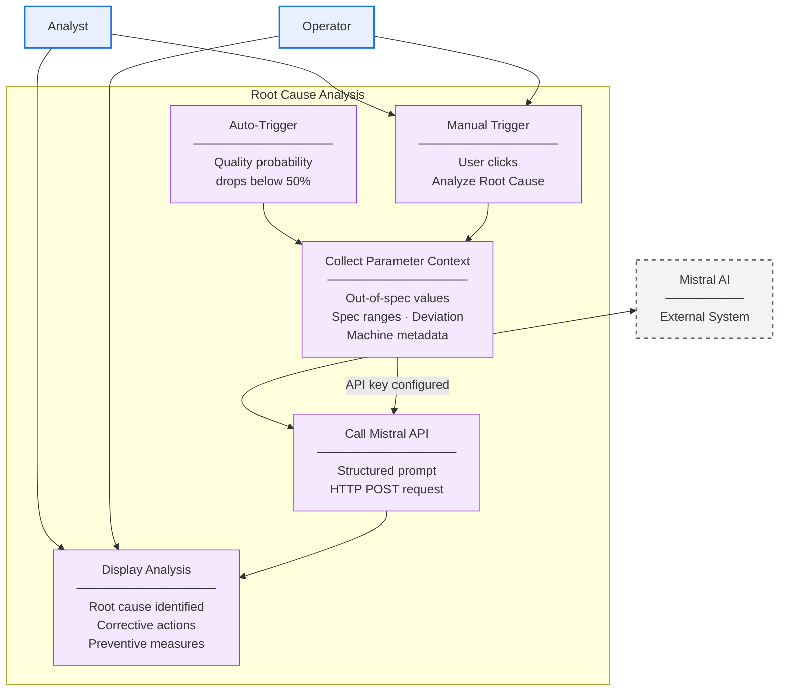

# Figure 3.5 — Mistral AI Integration Use Case Diagram

System sends out-of-specification parameter data to Mistral AI and displays structured root cause analysis.

```mermaid
flowchart TD
    ANL[Analyst]
    OPR[Operator]
    MISTRAL["Mistral AI
        ─────────
        External System"]

    subgraph RCA["Root Cause Analysis"]
        AUTO["Auto-Trigger
            ────────────────
            Quality probability
            drops below 50%"]
        MANUAL["Manual Trigger
            ────────────────
            User clicks
            Analyze Root Cause"]
        COLLECT["Collect Parameter Context
            ────────────────
            Out-of-spec values
            Spec ranges · Deviation
            Machine metadata"]
        API["Call Mistral API
            ────────────────
            Structured prompt
            HTTP POST request"]
        DISPLAY["Display Analysis
            ────────────────
            Root cause identified
            Corrective actions
            Preventive measures"]
    end

    ANL --> MANUAL & DISPLAY
    OPR --> MANUAL & DISPLAY
    MISTRAL <--> API

    AUTO --> COLLECT
    MANUAL --> COLLECT
    COLLECT -->|API key configured| API
    API --> DISPLAY

    classDef actor fill:#e8f0fe,stroke:#1a73e8,stroke-width:2px;
    classDef external fill:#f1f3f4,stroke:#5f6368,stroke-width:2px,stroke-dasharray:5 5;
    classDef uc fill:#f3e8fd,stroke:#9334ea,stroke-width:1px;
    class ANL,OPR actor;
    class MISTRAL external;
    class AUTO,MANUAL,COLLECT,API,DISPLAY uc;
```
