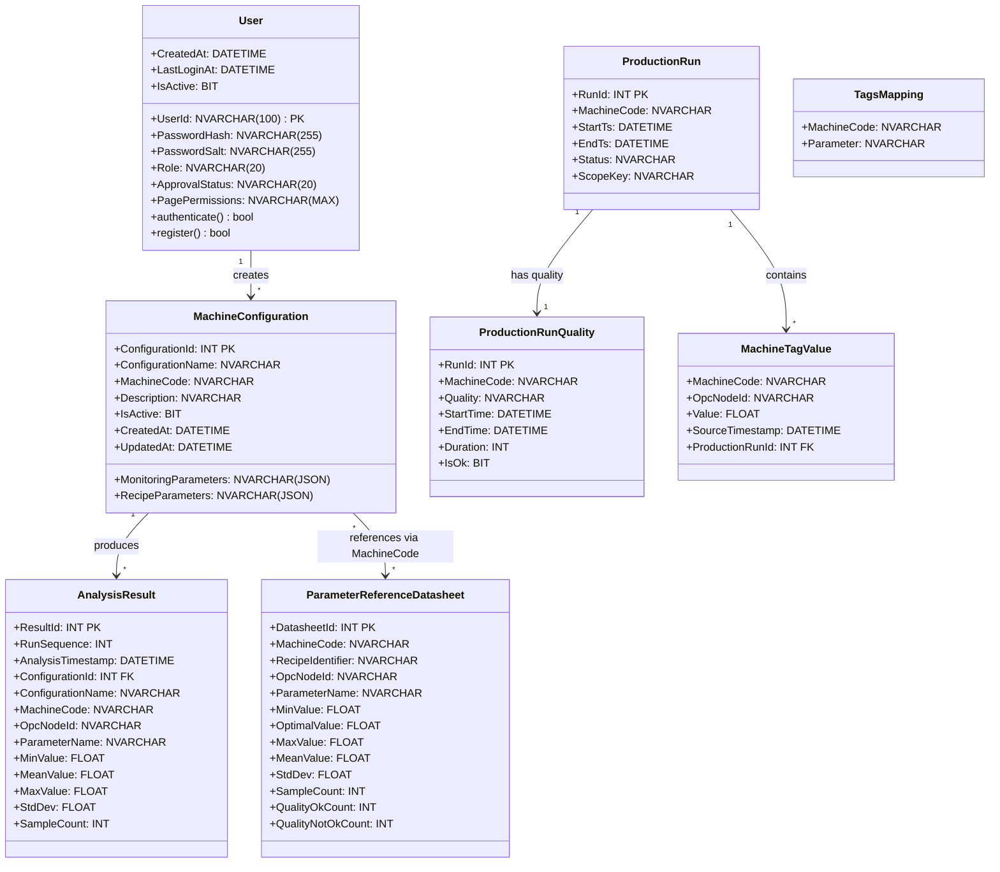

# Figure 3.6 — Class Diagram — System Entities

> Core entities of Cable Manufacturing AI with their attributes and relationships.

```mermaid
classDiagram
    class User {
        +UserId: NVARCHAR(100) PK
        +PasswordHash: NVARCHAR(255)
        +PasswordSalt: NVARCHAR(255)
        +Role: NVARCHAR(20)
        +ApprovalStatus: NVARCHAR(20)
        +PagePermissions: NVARCHAR(MAX)
        +CreatedAt: DATETIME
        +LastLoginAt: DATETIME
        +IsActive: BIT
        +authenticate() bool
        +register() bool
    }

    class MachineConfiguration {
        +ConfigurationId: INT PK
        +ConfigurationName: NVARCHAR
        +MachineCode: NVARCHAR
        +MonitoringParameters: NVARCHAR (JSON)
        +RecipeParameters: NVARCHAR (JSON)
        +Description: NVARCHAR
        +IsActive: BIT
        +CreatedAt: DATETIME
        +UpdatedAt: DATETIME
    }

    class ProductionRun {
        +RunId: INT PK
        +MachineCode: NVARCHAR
        +StartTs: DATETIME
        +EndTs: DATETIME
        +Status: NVARCHAR
        +ScopeKey: NVARCHAR
    }

    class ProductionRunQuality {
        +RunId: INT PK
        +MachineCode: NVARCHAR
        +Quality: NVARCHAR
        +StartTime: DATETIME
        +EndTime: DATETIME
        +Duration: INT
        +IsOk: BIT
    }

    class MachineTagValue {
        +MachineCode: NVARCHAR
        +OpcNodeId: NVARCHAR
        +Value: FLOAT
        +SourceTimestamp: DATETIME
        +ProductionRunId: INT FK
    }

    class ParameterReferenceDatasheet {
        +DatasheetId: INT PK
        +MachineCode: NVARCHAR
        +RecipeIdentifier: NVARCHAR
        +OpcNodeId: NVARCHAR
        +ParameterName: NVARCHAR
        +MinValue: FLOAT
        +OptimalValue: FLOAT
        +MaxValue: FLOAT
        +MeanValue: FLOAT
        +StdDev: FLOAT
        +SampleCount: INT
        +QualityOkCount: INT
        +QualityNotOkCount: INT
    }

    class TagsMapping {
        +MachineCode: NVARCHAR
        +Parameter: NVARCHAR
    }

    class AnalysisResult {
        +ResultId: INT PK
        +RunSequence: INT
        +AnalysisTimestamp: DATETIME
        +ConfigurationId: INT FK
        +ConfigurationName: NVARCHAR
        +MachineCode: NVARCHAR
        +OpcNodeId: NVARCHAR
        +ParameterName: NVARCHAR
        +MinValue: FLOAT
        +MeanValue: FLOAT
        +MaxValue: FLOAT
        +StdDev: FLOAT
        +SampleCount: INT
    }

    %% Relationships
    User "1" --> "*" MachineConfiguration : creates
    MachineConfiguration "1" --> "*" AnalysisResult : produces
    ProductionRun "1" --> "1" ProductionRunQuality : has quality
    ProductionRun "1" --> "*" MachineTagValue : contains
    MachineConfiguration "*" --> "*" ParameterReferenceDatasheet : references via MachineCode
```
