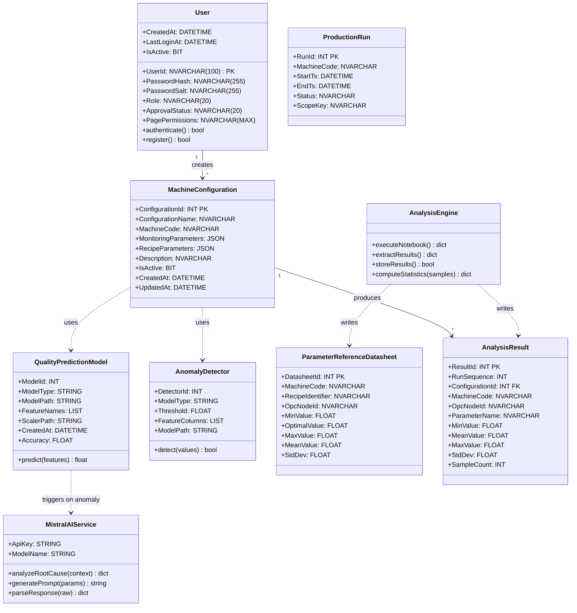

# Figure 3.7 — Class Diagram (With ML Backend)

> Extended class diagram including ML models, anomaly detection, Mistral AI service, and the analysis engine.

```mermaid
classDiagram
    class User {
        +UserId: NVARCHAR(100) PK
        +PasswordHash: NVARCHAR(255)
        +PasswordSalt: NVARCHAR(255)
        +Role: NVARCHAR(20)
        +ApprovalStatus: NVARCHAR(20)
        +PagePermissions: NVARCHAR(MAX)
        +CreatedAt: DATETIME
        +LastLoginAt: DATETIME
        +IsActive: BIT
        +authenticate() bool
        +register() bool
    }

    class MachineConfiguration {
        +ConfigurationId: INT PK
        +ConfigurationName: NVARCHAR
        +MachineCode: NVARCHAR
        +MonitoringParameters: JSON
        +RecipeParameters: JSON
        +Description: NVARCHAR
        +IsActive: BIT
        +CreatedAt: DATETIME
        +UpdatedAt: DATETIME
    }

    class ProductionRun {
        +RunId: INT PK
        +MachineCode: NVARCHAR
        +StartTs: DATETIME
        +EndTs: DATETIME
        +Status: NVARCHAR
        +ScopeKey: NVARCHAR
    }

    class QualityPredictionModel {
        +ModelId: INT
        +ModelType: STRING
        +ModelPath: STRING
        +FeatureNames: LIST
        +ScalerPath: STRING
        +CreatedAt: DATETIME
        +Accuracy: FLOAT
        +predict(features) float
    }

    class AnomalyDetector {
        +DetectorId: INT
        +ModelType: STRING
        +Threshold: FLOAT
        +FeatureColumns: LIST
        +ModelPath: STRING
        +detect(values) bool
    }

    class MistralAIService {
        +ApiKey: STRING
        +ModelName: STRING
        +analyzeRootCause(context) dict
        +generatePrompt(params) string
        +parseResponse(raw) dict
    }

    class AnalysisEngine {
        +executeNotebook() dict
        +extractResults() dict
        +storeResults() bool
        +computeStatistics(samples) dict
    }

    class ParameterReferenceDatasheet {
        +DatasheetId: INT PK
        +MachineCode: NVARCHAR
        +RecipeIdentifier: NVARCHAR
        +OpcNodeId: NVARCHAR
        +MinValue: FLOAT
        +OptimalValue: FLOAT
        +MaxValue: FLOAT
        +MeanValue: FLOAT
        +StdDev: FLOAT
    }

    class AnalysisResult {
        +ResultId: INT PK
        +RunSequence: INT
        +ConfigurationId: INT FK
        +MachineCode: NVARCHAR
        +OpcNodeId: NVARCHAR
        +ParameterName: NVARCHAR
        +MinValue: FLOAT
        +MeanValue: FLOAT
        +MaxValue: FLOAT
        +StdDev: FLOAT
        +SampleCount: INT
    }

    %% Relationships
    User "1" --> "*" MachineConfiguration : creates
    MachineConfiguration "1" --> "*" AnalysisResult : produces
    AnalysisEngine ..> AnalysisResult : writes
    AnalysisEngine ..> ParameterReferenceDatasheet : writes
    MachineConfiguration ..> QualityPredictionModel : uses
    MachineConfiguration ..> AnomalyDetector : uses
    QualityPredictionModel ..> MistralAIService : triggers on anomaly
```
