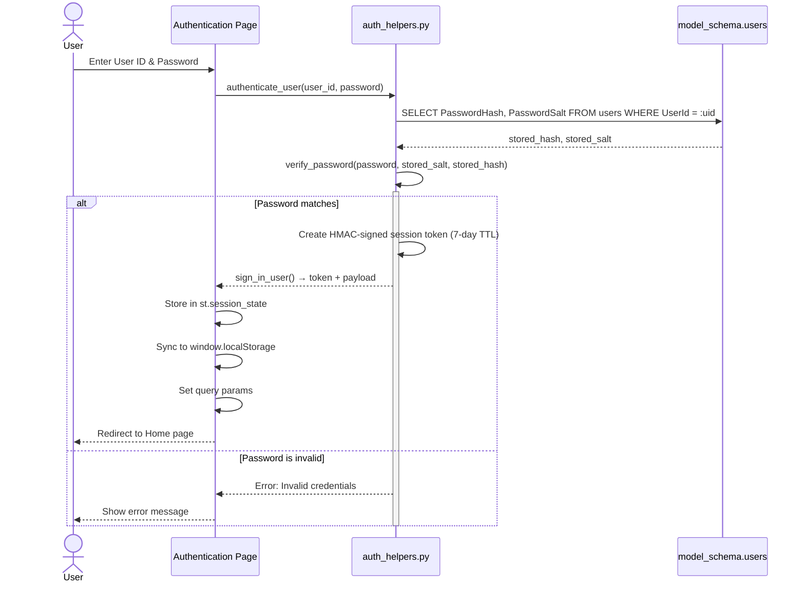

# Figure 3.8 — Authentication Sequence Diagram

> Chronological interaction between User, Authentication Page, auth_helpers, and the Database during login.

```mermaid
sequenceDiagram
    actor U as User
    participant AuthPage as Authentication Page
    participant AuthHelpers as auth_helpers.py
    participant DB as model_schema.users

    U->>AuthPage: Enter User ID & Password
    AuthPage->>AuthHelpers: authenticate_user(user_id, password)
    AuthHelpers->>DB: SELECT PasswordHash, PasswordSalt FROM users WHERE UserId = :uid
    DB-->>AuthHelpers: stored_hash, stored_salt
    AuthHelpers->>AuthHelpers: verify_password(password, stored_salt, stored_hash)
    activate AuthHelpers

    alt Password matches
        AuthHelpers->>AuthHelpers: Create HMAC-signed session token (7-day TTL)
        AuthHelpers-->>AuthPage: sign_in_user() → token + payload
        AuthPage->>AuthPage: Store in st.session_state
        AuthPage->>AuthPage: Sync to window.localStorage
        AuthPage->>AuthPage: Set query params
        AuthPage-->>U: Redirect to Home page
    else Password is invalid
        AuthHelpers-->>AuthPage: Error: Invalid credentials
        AuthPage-->>U: Show error message
    end
    deactivate AuthHelpers
```
