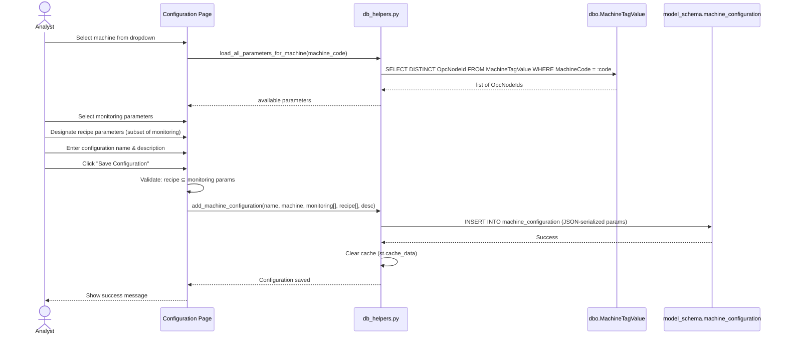

# Figure 3.9 — Machine Configuration Sequence Diagram

> Analyst creates a new machine configuration by selecting parameters and saving to the database.

```mermaid
sequenceDiagram
    actor A as Analyst
    participant ConfigPage as Configuration Page
    participant DBHelpers as db_helpers.py
    participant MTV as dbo.MachineTagValue
    participant MC as model_schema.machine_configuration

    A->>ConfigPage: Select machine from dropdown
    ConfigPage->>DBHelpers: load_all_parameters_for_machine(machine_code)
    DBHelpers->>MTV: SELECT DISTINCT OpcNodeId FROM MachineTagValue WHERE MachineCode = :code
    MTV-->>DBHelpers: list of OpcNodeIds
    DBHelpers-->>ConfigPage: available parameters

    A->>ConfigPage: Select monitoring parameters
    A->>ConfigPage: Designate recipe parameters (subset of monitoring)
    A->>ConfigPage: Enter configuration name & description
    A->>ConfigPage: Click "Save Configuration"

    ConfigPage->>ConfigPage: Validate: recipe ⊆ monitoring params
    ConfigPage->>DBHelpers: add_machine_configuration(name, machine, monitoring[], recipe[], desc)
    DBHelpers->>MC: INSERT INTO machine_configuration (JSON-serialized params)
    MC-->>DBHelpers: Success
    DBHelpers->>DBHelpers: Clear cache (st.cache_data)
    DBHelpers-->>ConfigPage: Configuration saved
    ConfigPage-->>A: Show success message
```
