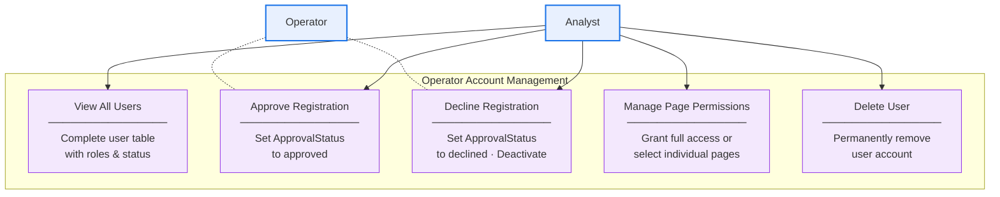

# Figure 3.X — Operator Account Management Use Case Diagram

Analyst manages operator accounts including registration approval, page permissions, and account deletion.

```mermaid
flowchart TD
    ANL[Analyst]
    OPR[Operator]

    subgraph Admin["Operator Account Management"]
        LIST["View All Users
            ────────────────
            Complete user table
            with roles & status"]
        APPROVE["Approve Registration
            ────────────────
            Set ApprovalStatus
            to approved"]
        DECLINE["Decline Registration
            ────────────────
            Set ApprovalStatus
            to declined · Deactivate"]
        PERMS["Manage Page Permissions
            ────────────────
            Grant full access or
            select individual pages"]
        DELETE["Delete User
            ────────────────
            Permanently remove
            user account"]
    end

    ANL --> LIST & APPROVE & DECLINE & PERMS & DELETE

    OPR -.- APPROVE
    OPR -.- DECLINE

    classDef actor fill:#e8f0fe,stroke:#1a73e8,stroke-width:2px;
    classDef admin fill:#f3e8fd,stroke:#9334ea,stroke-width:1px;
    class ANL,OPR actor;
    class LIST,APPROVE,DECLINE,PERMS,DELETE admin;
```
