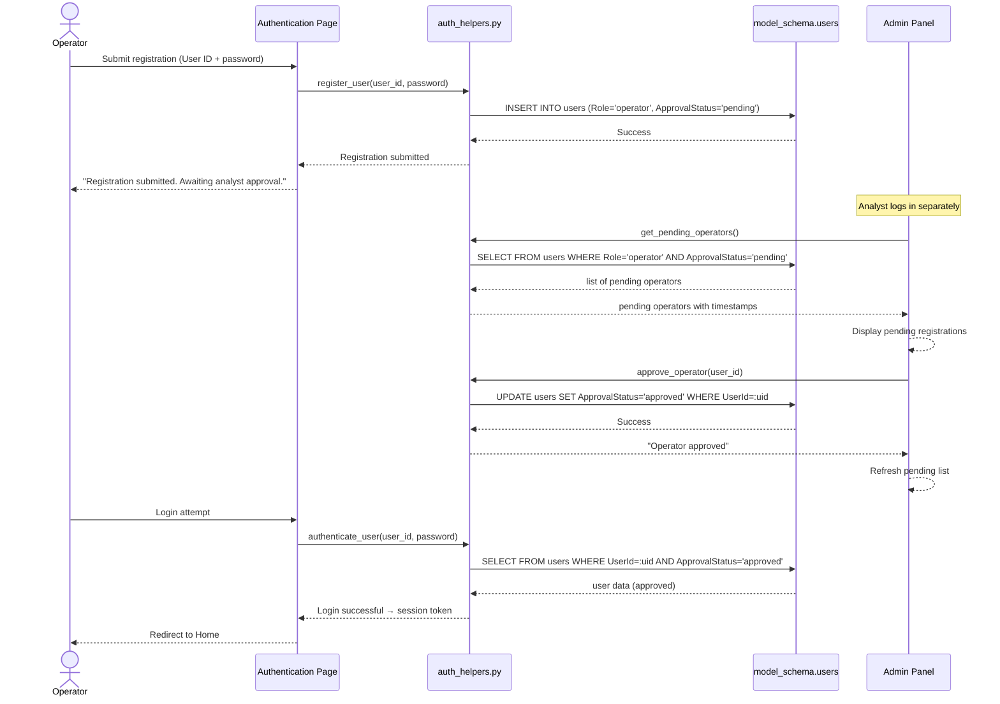

# Figure 3.X — Operator Approval Sequence Diagram (NEW)

> Operator registers, receives pending status, Analyst approves/declines via Admin Panel.

```mermaid
sequenceDiagram
    actor O as Operator
    participant AuthPage as Authentication Page
    participant AuthHelpers as auth_helpers.py
    participant DB as model_schema.users
    participant AdminPage as Admin Panel

    O->>AuthPage: Submit registration (User ID + password)
    AuthPage->>AuthHelpers: register_user(user_id, password)
    AuthHelpers->>DB: INSERT INTO users (Role='operator', ApprovalStatus='pending')
    DB-->>AuthHelpers: Success
    AuthHelpers-->>AuthPage: Registration submitted
    AuthPage-->>O: "Registration submitted. Awaiting analyst approval."

    Note over AdminPage: Analyst logs in separately

    AdminPage->>AuthHelpers: get_pending_operators()
    AuthHelpers->>DB: SELECT FROM users WHERE Role='operator' AND ApprovalStatus='pending'
    DB-->>AuthHelpers: list of pending operators
    AuthHelpers-->>AdminPage: pending operators with timestamps

    AdminPage-->>AdminPage: Display pending registrations

    AdminPage->>AuthHelpers: approve_operator(user_id)
    AuthHelpers->>DB: UPDATE users SET ApprovalStatus='approved' WHERE UserId=:uid
    DB-->>AuthHelpers: Success
    AuthHelpers-->>AdminPage: "Operator approved"
    AdminPage-->>AdminPage: Refresh pending list

    O->>AuthPage: Login attempt
    AuthPage->>AuthHelpers: authenticate_user(user_id, password)
    AuthHelpers->>DB: SELECT FROM users WHERE UserId=:uid AND ApprovalStatus='approved'
    DB-->>AuthHelpers: user data (approved)
    AuthHelpers-->>AuthPage: Login successful → session token
    AuthPage-->>O: Redirect to Home
```
