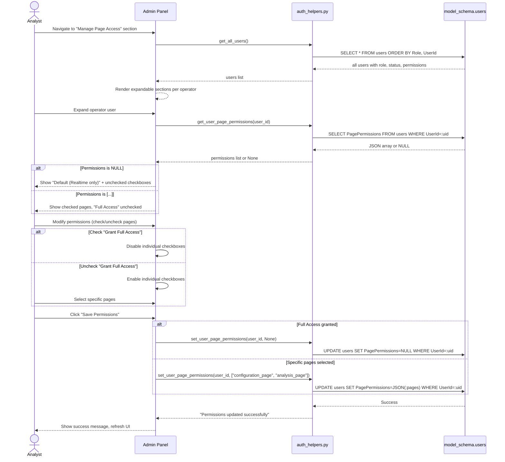

# Figure 3.X — Page Permission Management Sequence Diagram (NEW)

> Analyst configures per-operator page-level access via checkbox interface in the Admin Panel.

```mermaid
sequenceDiagram
    actor A as Analyst
    participant AdminPage as Admin Panel
    participant AuthHelpers as auth_helpers.py
    participant DB as model_schema.users

    A->>AdminPage: Navigate to "Manage Page Access" section
    AdminPage->>AuthHelpers: get_all_users()
    AuthHelpers->>DB: SELECT * FROM users ORDER BY Role, UserId
    DB-->>AuthHelpers: all users with role, status, permissions
    AuthHelpers-->>AdminPage: users list

    AdminPage-->>AdminPage: Render expandable sections per operator
    A->>AdminPage: Expand operator user

    AdminPage->>AuthHelpers: get_user_page_permissions(user_id)
    AuthHelpers->>DB: SELECT PagePermissions FROM users WHERE UserId=:uid
    DB-->>AuthHelpers: JSON array or NULL
    AuthHelpers-->>AdminPage: permissions list or None

    alt Permissions is NULL
        AdminPage-->>A: Show "Default (Realtime only)" + unchecked checkboxes
    else Permissions is [...]
        AdminPage-->>A: Show checked pages, "Full Access" unchecked
    end

    A->>AdminPage: Modify permissions (check/uncheck pages)
    alt Check "Grant Full Access"
        AdminPage->>AdminPage: Disable individual checkboxes
    else Uncheck "Grant Full Access"
        AdminPage->>AdminPage: Enable individual checkboxes
        A->>AdminPage: Select specific pages
    end

    A->>AdminPage: Click "Save Permissions"

    alt Full Access granted
        AdminPage->>AuthHelpers: set_user_page_permissions(user_id, None)
        AuthHelpers->>DB: UPDATE users SET PagePermissions=NULL WHERE UserId=:uid
    else Specific pages selected
        AdminPage->>AuthHelpers: set_user_page_permissions(user_id, ["configuration_page", "analysis_page"])
        AuthHelpers->>DB: UPDATE users SET PagePermissions=JSON(:pages) WHERE UserId=:uid
    end

    DB-->>AuthHelpers: Success
    AuthHelpers-->>AdminPage: "Permissions updated successfully"
    AdminPage-->>A: Show success message, refresh UI
```
