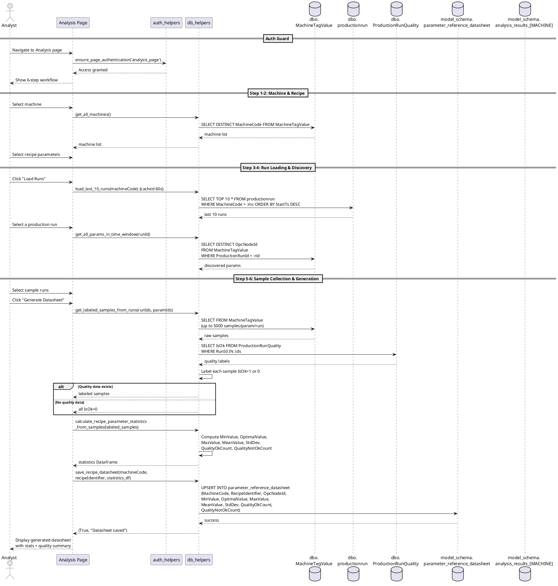

# Figure 3.11 — Datasheet Analysis Sequence Diagram

**Location:** Chapter 3 — Conception / §3.2.3.4 Datasheet Analysis  
**Type:** UML Sequence Diagram  
**Page Reference:** 31  

---

## Purpose

Model the end-to-end flow for generating a statistical reference datasheet. The Analyst selects a machine and recipe parameters, browses production runs, discovers run parameters, selects sample runs, and triggers notebook-based analysis that computes specification ranges.

---

## Lifelines

| Lifeline | Type | Description |
|----------|------|-------------|
| **Analyst** | Actor | Authenticated Analyst user |
| **Analysis Page** | Boundary | Streamlit UI (`analysis_page.py`) |
| **auth_helpers** | Controller | `auth_helpers.py` — `ensure_page_authentication()` |
| **db_helpers** | Controller | `db_helpers.py` — data access and analysis functions |
| **dbo.productionrun** | Entity | Stores production run metadata (RunId, MachineCode, StartTs, EndTs) |
| **dbo.ProductionRunQuality** | Entity | Stores quality labels per production run (IsOk flag) |
| **dbo.MachineTagValue** | Entity | Stores raw OPC UA sensor readings (MachineCode, OpcNodeId, Value, SourceTimestamp) |
| **model_schema.parameter_reference_datasheet** | Entity | Stores computed Min/Optimal/Max/Mean/StdDev per parameter |
| **model_schema.analysis_results_[MACHINE]** | Entity | Stores analysis history with versioned RunSequence |
| **model_schema.analysis_results** | Entity | Stores overall analysis session metadata (config, correlation, summary) |

---

## Flow: Authentication & Initialization

1. **Analyst** → **Analysis Page**: Navigates to Analysis page
2. **Analysis Page** → **auth_helpers**: Calls `ensure_page_authentication('analysis_page')`
3. **auth_helpers**: Verifies session token — access granted to all pages (single Analyst role)
4. **auth_helpers** → **Analysis Page**: Access granted (or redirect to login)
5. **Analysis Page** → **Analyst**: Displays 6-step guided workflow

---

## Flow: Step 1–2 — Machine & Recipe Selection

6. **Analyst** → **Analysis Page**: Selects a machine from dropdown
7. **Analysis Page** → **db_helpers**: Calls `get_all_machines()`
8. **db_helpers** → **dbo.MachineTagValue**: Returns distinct machine list
9. **Analyst** → **Analysis Page**: Selects recipe parameters (OpcNodeIds)
10. **Analysis Page**: Stores Step 1–2 state in `st.session_state`

---

## Flow: Step 3–4 — Run Loading & Parameter Discovery

11. **Analyst** → **Analysis Page**: Clicks "Load Runs"
12. **Analysis Page** → **db_helpers**: Calls `load_last_10_runs(machineCode)` (cached TTL 60s)
13. **db_helpers** → **dbo.productionrun**: `SELECT TOP 10 * FROM dbo.productionrun WHERE MachineCode = :mc ORDER BY StartTs DESC`
14. **dbo.productionrun** → **db_helpers**: Returns last 10 production runs
15. **Analyst** → **Analysis Page**: Selects a specific production run
16. **Analysis Page** → **db_helpers**: Calls `get_all_params_in_time_window(runId)`
17. **db_helpers** → **dbo.MachineTagValue**: Queries distinct OpcNodeIds in the run's time window
18. **dbo.MachineTagValue** → **db_helpers**: Returns parameter list for that run
19. **Analysis Page** → **Analyst**: Discovered parameters displayed

---

## Flow: Step 5–6 — Sample Collection & Datasheet Generation

20. **Analyst** → **Analysis Page**: Selects sample runs (1–10 runs for data collection)
21. **Analyst** → **Analysis Page**: Clicks "Generate Datasheet"
22. **Analysis Page** → **db_helpers**: Calls `get_labeled_samples_from_runs(runIds, parameterIds)`
23. **db_helpers** → **dbo.MachineTagValue**: Queries samples in run time windows (up to 5,000 per parameter per run)
24. **dbo.MachineTagValue** → **db_helpers**: Returns labeled samples (tagged with ProductionRunId)
25. **db_helpers** → **dbo.ProductionRunQuality**: Queries IsOk labels
26. **dbo.ProductionRunQuality** → **db_helpers**: Returns quality labels keyed by RunId
27. **db_helpers**: Labels each sample: IsOk = 1 or 0
28. **db_helpers** → **Analysis Page**: Returns labeled sample data
29. **Analysis Page** → **db_helpers**: Calls `calculate_recipe_parameter_statistics_from_samples(labeled_samples)`

**Statistics Computation (inside db_helpers):**

30. **db_helpers**: For each parameter:
    - `MinValue = min(all values)`
    - `OptimalValue = median(values where IsOk = 1)`
    - `MaxValue = max(all values)`
    - `MeanValue = mean(all values)`
    - `StdDev = std(all values)`
    - `QualityOkCount = count(IsOk = 1)`
    - `QualityNotOkCount = count(IsOk = 0)`
31. **db_helpers**: Returns computed statistics DataFrame

---

## Flow: Save & Display

32. **Analysis Page** → **db_helpers**: Calls `save_recipe_datasheet(machineCode, recipeIdentifier, statistics_df)`
33. **db_helpers** → **model_schema.parameter_reference_datasheet**: Upserts `(MachineCode, RecipeIdentifier, OpcNodeId, MinValue, OptimalValue, MaxValue, MeanValue, StdDev, QualityOkCount, QualityNotOkCount)`
34. **model_schema.parameter_reference_datasheet** → **db_helpers**: Returns success
35. **db_helpers** → **Analysis Page**: Returns `(True, "Datasheet saved")`
36. **Analysis Page** → **Analyst**: Displays generated datasheet with:
    - Parameter name, MinValue, OptimalValue, MaxValue, MeanValue, StdDev
    - Sample counts: QualityOkCount, QualityNotOkCount
    - Quality correlation summary

---

## Authentication Emphasis

- **Entry guard:** `ensure_page_authentication('analysis_page')` at step 2. Without authentication, no analysis workflow is accessible.
- **Page access:** All authenticated Analysts have unconditional access to the Analysis page.
- **Session persistence:** The 6-step workflow state is stored in `st.session_state`. If the session expires, the user must restart from Step 1.
- **All operations are exclusive to Analysts** (the sole user role).

---

## Notes for Diagram Generation

- Show **Analyst** as actor, **Analysis Page**, **auth_helpers**, **db_helpers**, **dbo.MachineTagValue**, **dbo.productionrun**, **dbo.ProductionRunQuality**, **model_schema.parameter_reference_datasheet**, and **model_schema.analysis_results_[MACHINE]** as lifelines.
- Use `alt` fragments for:
  - `alt` [access granted] → full workflow vs [access denied] → error message
  - `alt` [ProductionRunQuality exists] → label with IsOk vs [no quality data] → all IsOk=0
  - `alt` [database deadlock] → retry with backoff vs [success] → continue
- Use `ref` to reference the authentication sequence as a sub-flow.
- Show the 6 steps as sequential message blocks. Group them with notes on the left side: "Step 1–2: Setup", "Step 3–4: Discovery", "Step 5–6: Generation".
- Statistics are computed in-memory by `db_helpers.calculate_recipe_parameter_statistics_from_samples()` — no notebook execution.
- Label the statistical formulas as notes on the computation step.

---

## PlantUML Code

