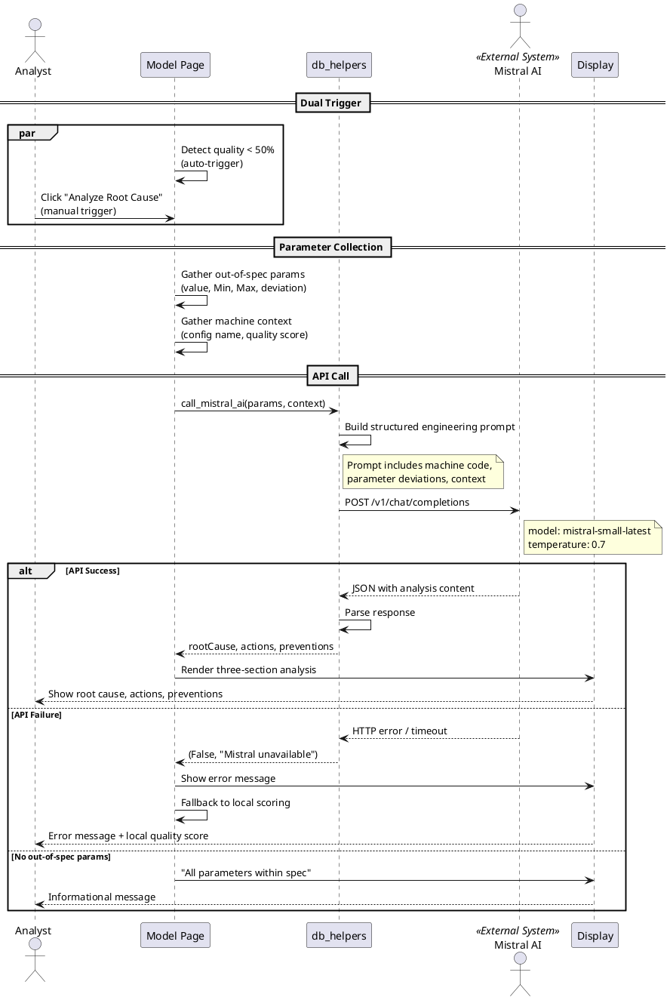

# Figure 3.12 — Root Cause Analysis Sequence Diagram

**Location:** Chapter 3 — Conception / §3.2.3.5  
**Type:** UML Sequence Diagram  

---

## Purpose

Mistral AI root cause analysis. The **Analyst** triggers it manually, or the system auto-triggers when quality < 50%.

---

## Lifelines

| Lifeline | Type |
|----------|------|
| **Analyst** | Actor |
| **Model Page** | Boundary |
| **db_helpers** | Controller |
| **Mistral AI** | External System |
| **Display** | Boundary |

---

## Flow: Trigger

```
par [Dual trigger paths]
```

1. **Model Page** (monitoring fragment): Detects `quality < 50%` → auto flag
2. **Analyst** → **Model Page**: Clicks "Analyze Root Cause" → manual flag

```
end par
```

---

## Flow: Parameter Collection

3. **Model Page**: Gathers out-of-spec params (value, Min, Max, deviation, machine code)
4. **Model Page**: Gathers machine context (config name, quality score)

---

## Flow: API Call

5. **Model Page** → **db_helpers**: `call_mistral_ai(params, context)`
6. **db_helpers**: Builds structured prompt with manufacturing context
7. **db_helpers** → **Mistral AI**: `POST /v1/chat/completions`
8. **Mistral AI**: Processes with `mistral-small-latest` at temperature 0.7
9. **Mistral AI** → **db_helpers**: Returns JSON with analysis content

---

## Flow: Response

10. **db_helpers**: Parses → extracts root cause, actions, preventions
11. **db_helpers** → **Model Page**: Returns structured result
12. **Model Page** → **Display**: Renders three-section analysis
13. **Display** → **Analyst**: Shows root cause, corrective actions, preventive measures

---

## Flow: Error Handling

```
alt [API failure]
```
14. **Mistral AI**: Returns error / timeout / or MISTRAL_API_KEY missing
15. **db_helpers** → **Model Page**: `(False, "Mistral unavailable")`
16. **Model Page** → **Analyst**: Shows error message + falls back to local quality scoring

```
alt [no out-of-spec params]
```
17. **Model Page** → **Analyst**: "All parameters within spec. No analysis needed."

---

## Notes for Diagram Generation

- Lifelines: **Analyst**, **Model Page**, **db_helpers**, **Mistral AI**, **Display**.
- `par` for dual trigger paths at top.
- `alt` for API success / failure / no-params cases.
- **Mistral AI** as `«External System»`.
- Note: `"POST /v1/chat/completions"` on the message arrow.

---

## PlantUML Code


