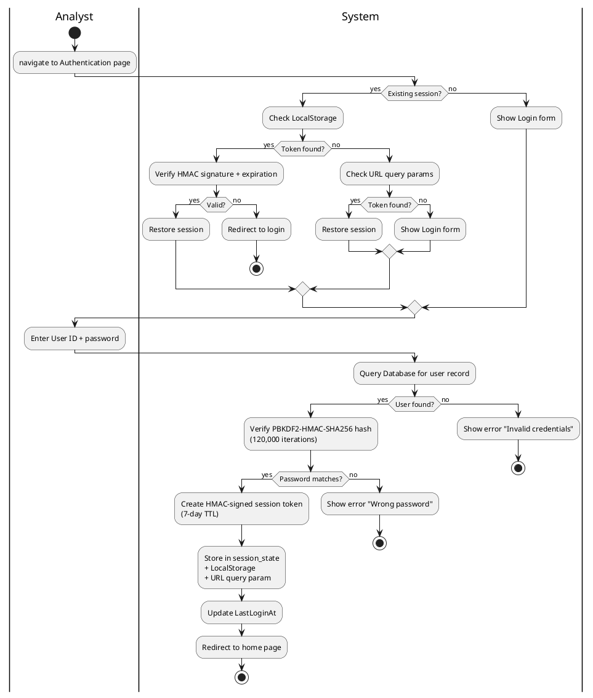

# Figure 3.13 — User Login Activity Diagram

**Location:** Chapter 3 — Conception / §3.2.4.1  
**Type:** UML Activity Diagram  

---

## Purpose

Login workflow with 3-layer session recovery and PBKDF2 credential validation. The single **Analyst** actor authenticates to access the system.

---

## Swimlanes

| Lane | Actions |
|------|---------|
| **Analyst** | Navigates, enters credentials, receives feedback |
| **System** | Session recovery, credential check, token creation, redirect |

---

## Flow

```
[Start] → Analyst navigates to Authentication page

    ┌─ [Decision: Existing session?] ─┐
    │        ↓              ↓         │
    │      [Yes]          [No]        │
    │        ↓              ↓         │
    │  System checks    System shows  │
    │  LocalStorage     Login form    │
    │        ↓              ↓         │
    │  [Token found?]   Analyst       │
    │    ↓       ↓      enters ID +   │
    │  [Yes]   [No]     password      │
    │    ↓       ↓          ↓         │
    │  Verify    Check     System     │
    │  HMAC +    URL       queries    │
    │  expiry    params    Database   │
    │    ↓       ↓  ↓         ↓       │
    │  [Valid] [Yes][No]  [Found?]    │
    │    ↓       ↓   ↓    ↓      ↓    │
    │  Restore  Restore  Show  [Yes] [No]
    │  session  session  Login  ↓     ↓
    │    ↓       ↓       form  Verify  Show
    │  Redirect Redirect      hash    error
    │  to home  to home         ↓     "Invalid"
    │                        [Match?]   ↓
    │                         ↓    ↓  [End]
    │                      [Yes] [No]
    │                         ↓    ↓
    │                   Create   Show error
    │                   session  "Wrong
    │                   token    password"
    │                   HMAC          ↓
    │                   7-day TTL   [End]
    │                         ↓
    │                   Store in
    │                   session_state
    │                   + LocalStorage
    │                   + query param
    │                         ↓
    │                   Update
    │                   LastLoginAt
    │                         ↓
    │                   Redirect
    │                   to home page
    │                         ↓
    │                      [End]
```

---

## Decision Nodes

| # | Decision | Branches |
|---|----------|----------|
| D1 | Existing session? | [Yes] / [No] |
| D2 | Token in LocalStorage? | [Yes] / [No] |
| D3 | Token in URL params? | [Yes] / [No] |
| D4 | User found? | [Found] / [Not found] |
| D5 | Password matches? | [Yes] / [No] |

---

## Notes for Diagram Generation

- 2 swimlanes: **Analyst** (left), **System** (right).
- 3-layer recovery at top: session_state → URL params → LocalStorage.
- PBKDF2 hashing as sub-action with note `"120,000 iterations"`.
- Error paths: `[No match]` → "Wrong password", `[Not found]` → "Invalid credentials".

---

## PlantUML Code


