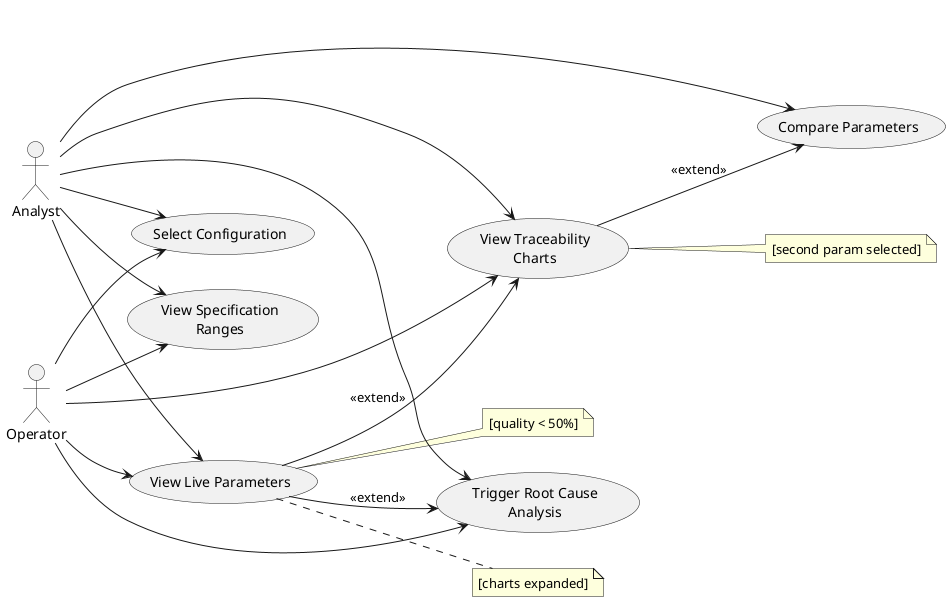

# Figure 3.3 — Real-Time Monitoring Use Case Diagram

**Location:** Chapter 3 — Conception / §3.2.1.3  
**Type:** UML Use Case Diagram  

---

## Purpose

Real-time monitoring subsystem. Both Analyst and Operator can select a configuration, view live parameter values, compare against specification ranges, view traceability charts, and trigger root cause analysis when quality drops.

---

## Actors

| Actor | Description |
|-------|-------------|
| **Analyst** | Full access to monitoring features including parameter comparison and manual root cause analysis trigger. |
| **Operator** | Restricted access to monitoring features. Can view live data, specification ranges, charts, and trigger root cause analysis. |

---

## Use Cases

| # | Use Case | Description |
|---|----------|-------------|
| UC1 | Select Configuration | Choose a saved configuration from dropdown to begin monitoring session. |
| UC2 | View Live Parameters | Display real-time machine parameter values fetched from MachineTagValue every 1 second. |
| UC3 | View Specification Ranges | Display Min/Optimal/Max/Mean/StdDev from the latest reference datasheet for each parameter. |
| UC4 | View Traceability Charts | Visualize parameter trends with 3-second sliding window and full timeline views. |
| UC5 | Compare Parameters | Overlay two parameters on a single chart for correlation analysis (Analyst only). |
| UC6 | Trigger Root Cause Analysis | Send out-of-spec parameter data to Mistral AI for root cause analysis. Auto-triggered when quality < 50% or available as manual button. |

---

## Table 3.2 — Monitor Production — Use Case Textual Description

| Element | Description |
|---------|-------------|
| **Use Case Name** | Monitor Production |
| **Actor** | Analyst, Operator |
| **Description** | User views real-time parameter values compared against specification ranges with quality prediction probability. |
| **Precondition** | User is authenticated. Reference datasheet exists for the selected configuration. Machine is active. |
| **Postcondition** | User sees live parameter values with color-coded status indicators and quality score. |
| **Main Flow** | 1. User selects a configuration. 2. System loads the reference datasheet. 3. System fetches live values in a 1-second loop. 4. System computes quality probability. 5. System displays color-coded parameter cards. |
| **Alternative Flow** | If machine is Standby (LineSpeed=0), display "Standby" status. If no data received, show "Waiting for value...". If quality < 50%, auto-trigger Mistral analysis. |

---

## Relationships

### `<<extend>>`

| Source | Target | Condition |
|--------|--------|-----------|
| UC2 View Live Parameters | UC6 Trigger Root Cause Analysis | `[quality probability < 50%]` |
| UC2 View Live Parameters | UC4 View Traceability Charts | `[charts section expanded]` |
| UC4 View Traceability Charts | UC5 Compare Parameters | `[second parameter selected]` |

---

## Notes for Diagram Generation

- **2 actors**: Analyst (connected to UC5) and Operator outside the system boundary.
- Both actors connect to UC1, UC2, UC3, UC4, UC6.
- Only Analyst connects to UC5 Compare Parameters.
- Draw `<<extend>>` arrows for quality-triggered RCA and chart navigation flows.

---

## PlantUML Code

