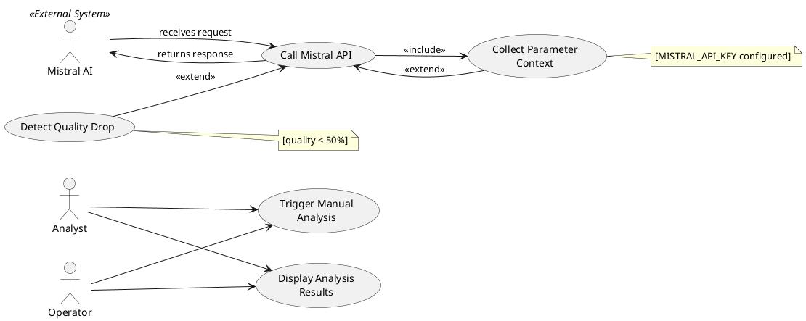

# Figure 3.5 — Mistral AI Integration Use Case Diagram

**Location:** Chapter 3 — Conception / §3.2.1.5  
**Type:** UML Use Case Diagram  

---

## Purpose

Root cause analysis subsystem. The system detects quality drops and triggers Mistral AI analysis (automatically when quality < 50% or via manual button click). Mistral AI is modeled as an external system actor.

---

## Actors

| Actor | Description |
|-------|-------------|
| **Analyst** | Can manually trigger root cause analysis and view results. |
| **Operator** | Can manually trigger root cause analysis and view results when quality drops are detected. |
| **Mistral AI** | `«External System»` — receives structured parameter data and returns natural-language root cause analysis with corrective and preventive actions. |

---

## Use Cases

| # | Use Case | Description |
|---|----------|-------------|
| UC1 | Detect Quality Drop | System continuously monitors quality probability and triggers analysis when it falls below 50%. |
| UC2 | Trigger Manual Analysis | User clicks the "Analyze Root Cause" button to manually request analysis. |
| UC3 | Collect Parameter Context | Gather out-of-spec parameter values, specification ranges, deviation metrics, and machine metadata. |
| UC4 | Call Mistral API | Construct structured engineering prompt and send HTTP POST request to the Mistral AI endpoint. |
| UC5 | Display Analysis Results | Parse the Mistral AI response and render structured results (root cause, corrective actions, preventive measures) in the UI. |

---

## Table 3.4 — Analyze Root Cause — Use Case Textual Description

| Element | Description |
|---------|-------------|
| **Use Case Name** | Analyze Root Cause |
| **Actor** | Analyst, Operator |
| **Description** | System sends out-of-specification parameter data to Mistral AI and receives natural-language root cause analysis. |
| **Precondition** | User is authenticated. MISTRAL_API_KEY is configured. At least one parameter is out of specification range. |
| **Postcondition** | User views AI-generated analysis with root cause, corrective actions, and preventive measures. |
| **Main Flow** | 1. Quality < 50% OR user clicks button. 2. System collects out-of-range parameters. 3. System constructs structured prompt. 4. System calls Mistral API. 5. System parses and displays response. |
| **Alternative Flow** | If Mistral API is unavailable, display error message with fallback to local scoring. If no parameters are out of range, notify user. If API key is missing, skip analysis. |

---

## Relationships

### `<<include>>`

| Source | Target | Rationale |
|--------|--------|-----------|
| UC4 Call Mistral API | UC3 Collect Parameter Context | API call requires pre-collected parameter context. |

### `<<extend>>`

| Source | Target | Condition |
|--------|--------|-----------|
| UC3 Collect Parameter Context | UC4 Call Mistral API | `[MISTRAL_API_KEY configured]` |
| UC1 Detect Quality Drop | UC4 Call Mistral API | `[quality < 50%]` |

---

## Notes for Diagram Generation

- **2 human actors**: Analyst and Operator. **1 external actor**: Mistral AI (`«External System»`).
- Two trigger paths converge at UC3 Collect Parameter Context: auto-trigger (UC1) and manual trigger (UC2).
- Show `<<include>>` from UC4 to UC3 to represent the data dependency.
- Show `<<extend>>` with guard conditions for the API key check and quality drop trigger.

---

## PlantUML Code

