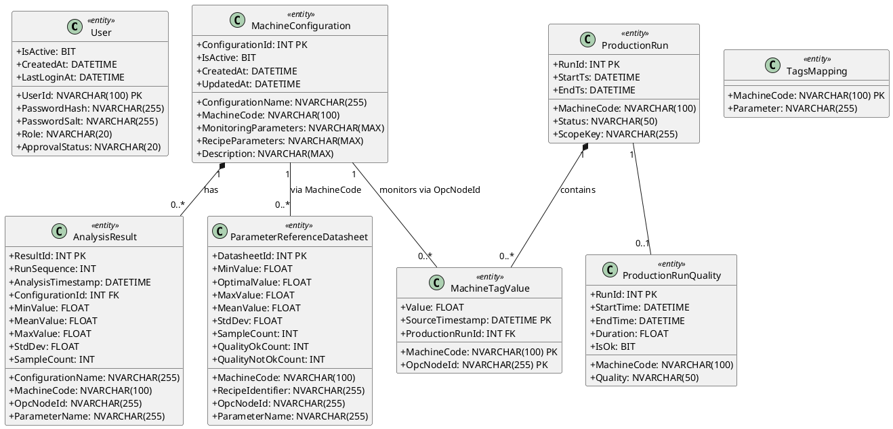

# Figure 3.6 — Class Diagram — System Entities

**Location:** Chapter 3 — Conception / §3.2.2 Class Diagram  
**Type:** UML Class Diagram  
**Page Reference:** 27  

---

## Purpose

Model the core data entities of Cable Manufacturing AI and their structural relationships. This diagram covers the user management, machine configuration, production tracking, and analysis entities stored in SQL Server.

---

## Classes

### 1. User

**Table:** `model_schema.users`

| Attribute | Type | Constraints | Description |
|-----------|------|-------------|-------------|
| `UserId` | `NVARCHAR(100)` | PK | Unique user identifier |
| `PasswordHash` | `NVARCHAR(255)` | NOT NULL | PBKDF2-HMAC-SHA256 hash (120,000 iterations) |
| `PasswordSalt` | `NVARCHAR(255)` | NOT NULL | Random 16-byte salt, base64-encoded |
| `Role` | `NVARCHAR(20)` | NOT NULL, DEFAULT 'operator' | 'operator' or 'analyst' |
| `ApprovalStatus` | `NVARCHAR(20)` | NOT NULL, DEFAULT 'approved' | 'approved', 'pending', or 'declined' |
| `IsActive` | `BIT` | NOT NULL, DEFAULT 1 | Whether the account is active |
| `CreatedAt` | `DATETIME` | NOT NULL, DEFAULT GETDATE() | Account creation timestamp |
| `LastLoginAt` | `DATETIME` | NULL | Last successful login |

**Note:** Authentication and registration are standalone functions in `auth_helpers.py`, not methods on a User class.

---

### 2. MachineConfiguration

**Table:** `model_schema.machine_configuration`

| Attribute | Type | Constraints | Description |
|-----------|------|-------------|-------------|
| `ConfigurationId` | `INT` | PK (auto-increment) | Unique configuration identifier |
| `ConfigurationName` | `NVARCHAR(255)` | NOT NULL | User-defined configuration name |
| `MachineCode` | `NVARCHAR(100)` | NOT NULL | Machine identifier |
| `MonitoringParameters` | `NVARCHAR(MAX)` | NOT NULL | JSON array of selected OpcNodeIds |
| `RecipeParameters` | `NVARCHAR(MAX)` | NOT NULL | JSON array of recipe-defining OpcNodeIds (subset of MonitoringParameters) |
| `Description` | `NVARCHAR(MAX)` | NULL | Free-text description |
| `IsActive` | `BIT` | NOT NULL, DEFAULT 1 | Soft-delete flag |
| `CreatedAt` | `DATETIME` | NOT NULL, DEFAULT GETDATE() | Creation timestamp |
| `UpdatedAt` | `DATETIME` | NULL | Last modification timestamp |

**Constraints:**
- Unique: `(ConfigurationName, MachineCode)` — no duplicate names per machine
- Check: `RecipeParameters ⊆ MonitoringParameters` (validated in application logic)

---

### 3. ProductionRun

**Table:** `dbo.productionrun`

| Attribute | Type | Constraints | Description |
|-----------|------|-------------|-------------|
| `RunId` | `INT` | PK | Unique run identifier |
| `MachineCode` | `NVARCHAR(100)` | NOT NULL | Machine that produced the run |
| `StartTs` | `DATETIME` | NOT NULL | Run start timestamp |
| `EndTs` | `DATETIME` | NULL | Run end timestamp |
| `Status` | `NVARCHAR(50)` | NULL | Run status (e.g., 'Completed', 'InProgress') |
| `ScopeKey` | `NVARCHAR(255)` | NULL | Recipe identifier for cross-machine correlation |

---

### 4. ProductionRunQuality

**Table:** `dbo.ProductionRunQuality`

| Attribute | Type | Constraints | Description |
|-----------|------|-------------|-------------|
| `RunId` | `INT` | PK | One-to-one with ProductionRun.RunId |
| `MachineCode` | `NVARCHAR(100)` | NOT NULL | Machine identifier |
| `Quality` | `NVARCHAR(50)` | NULL | Quality grade/description |
| `StartTime` | `DATETIME` | NULL | Quality observation start |
| `EndTime` | `DATETIME` | NULL | Quality observation end |
| `Duration` | `FLOAT` | NULL | Observation duration |
| `IsOk` | `BIT` | NOT NULL | Quality label: 1 = OK, 0 = NOT OK |

---

### 5. MachineTagValue

**Table:** `dbo.MachineTagValue`

| Attribute | Type | Constraints | Description |
|-----------|------|-------------|-------------|
| `MachineCode` | `NVARCHAR(100)` | Composite PK | Machine identifier |
| `OpcNodeId` | `NVARCHAR(255)` | Composite PK | OPC UA node identifier |
| `Value` | `FLOAT` | NULL | Sensor reading value |
| `SourceTimestamp` | `DATETIME` | Composite PK | Timestamp of the reading |
| `ProductionRunId` | `INT` | NULL FK → ProductionRun.RunId | Links reading to a production run |

---

### 6. ParameterReferenceDatasheet

**Table:** `model_schema.parameter_reference_datasheet`

| Attribute | Type | Constraints | Description |
|-----------|------|-------------|-------------|
| `DatasheetId` | `INT` | PK (auto-increment) | Unique datasheet identifier |
| `MachineCode` | `NVARCHAR(100)` | NOT NULL | Machine identifier |
| `RecipeIdentifier` | `NVARCHAR(255)` | NULL | Recipe scope identifier |
| `OpcNodeId` | `NVARCHAR(255)` | NOT NULL | Parameter identifier |
| `ParameterName` | `NVARCHAR(255)` | NULL | Human-readable parameter name |
| `MinValue` | `FLOAT` | NULL | Minimum observed value (overall) |
| `OptimalValue` | `FLOAT` | NULL | Median of OK-labeled samples |
| `MaxValue` | `FLOAT` | NULL | Maximum observed value (overall) |
| `MeanValue` | `FLOAT` | NULL | Mean of all samples |
| `StdDev` | `FLOAT` | NULL | Standard deviation of samples |
| `SampleCount` | `INT` | NULL | Total number of samples |
| `QualityOkCount` | `INT` | NULL | Number of OK-labeled samples |
| `QualityNotOkCount` | `INT` | NULL | Number of NOT OK-labeled samples |

---

### 7. TagsMapping

**Table:** `dbo.tags_mapping`

| Attribute | Type | Constraints | Description |
|-----------|------|-------------|-------------|
| `MachineCode` | `NVARCHAR(100)` | Composite PK | Machine identifier |
| `Parameter` | `NVARCHAR(255)` | NOT NULL | Tag/parameter name |

---

### 8. AnalysisResult

**Table:** `model_schema.analysis_results_[MACHINE]` (per-machine table)

| Attribute | Type | Constraints | Description |
|-----------|------|-------------|-------------|
| `ResultId` | `INT` | PK (auto-increment) | Unique result identifier |
| `RunSequence` | `INT` | NOT NULL | Sequential analysis version number |
| `AnalysisTimestamp` | `DATETIME` | NOT NULL, DEFAULT GETDATE() | When analysis was performed |
| `ConfigurationId` | `INT` | NULL FK → MachineConfiguration.ConfigurationId | Source configuration |
| `ConfigurationName` | `NVARCHAR(255)` | NULL | Snapshot of config name |
| `MachineCode` | `NVARCHAR(100)` | NOT NULL | Machine identifier |
| `OpcNodeId` | `NVARCHAR(255)` | NOT NULL | Parameter identifier |
| `ParameterName` | `NVARCHAR(255)` | NULL | Parameter display name |
| `MinValue` | `FLOAT` | NULL | Minimum from analysis |
| `MeanValue` | `FLOAT` | NULL | Mean from analysis |
| `MaxValue` | `FLOAT` | NULL | Maximum from analysis |
| `StdDev` | `FLOAT` | NULL | Standard deviation |
| `SampleCount` | `INT` | NULL | Sample count |

---

## Relationships

| Class A | Multiplicity | Class B | Multiplicity | Relationship | Description |
|---------|--------------|---------|--------------|--------------|-------------|
| **MachineConfiguration** | 1 | **AnalysisResult** | 0..* | Composition | A configuration has a history of analysis results |
| **ProductionRun** | 1 | **ProductionRunQuality** | 0..1 | Association | A run may have zero or one quality label |
| **ProductionRun** | 1 | **MachineTagValue** | 0..* | Composition | A run has many sensor readings |
| **MachineConfiguration** | 1 | **ParameterReferenceDatasheet** | 0..* | Association (via MachineCode) | A configuration's machine has datasheets |

---

## Notes for Diagram Generation

- Show all classes in a UML class diagram format with three compartments: **Class Name**, **Attributes** (with types and visibility), and **Methods** (where applicable).
- Use `+` for public, `-` for private, `#` for protected visibility.
- Mark primary keys with `{PK}` and foreign keys with `{FK}`.
- Show relationships with labeled association lines:
  - `1` — `0..*` between User and MachineConfiguration (labeled "creates")
  - `1` — `0..*` between MachineConfiguration and AnalysisResult (diamond for composition)
  - `1` — `0..1` between ProductionRun and ProductionRunQuality
   - `1` — `0..*` between ProductionRun and MachineTagValue (diamond for composition)
   - `1` — `0..*` between MachineConfiguration and MachineTagValue (labeled "monitors via OpcNodeId") — the `MonitoringParameters` JSON array stores OpcNodeId strings that correspond to `MachineTagValue.OpcNodeId`; at runtime the system uses these IDs to query live sensor data
- Highlight the **User** class as it is central to authentication.
- Note: "Single Analyst role. All authenticated users have full access. No approval workflows or page-level permission checks."

---

## PlantUML Code

