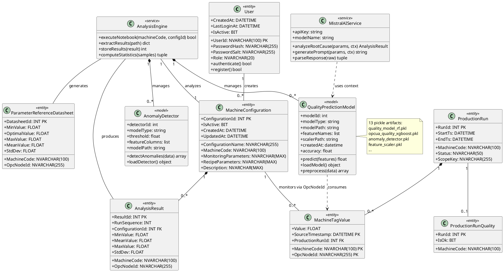

# Figure 3.7 — Class Diagram (With ML Backend)

**Location:** Chapter 3 — Conception / §3.2.2 Class Diagram (Extended)  
**Type:** UML Class Diagram  
**Page Reference:** 28  

---

## Purpose

Extend the core entity class diagram (Figure 3.6) with the machine-learning and AI backend components: quality prediction models, anomaly detection, Mistral AI service, and the analysis engine.

---

## Classes (Core Entities — from Figure 3.6)

Refer to `figure_3_6_class_diagram_system_entities.md` for full details of:
- User
- MachineConfiguration
- ProductionRun
- ProductionRunQuality
- MachineTagValue
- ParameterReferenceDatasheet
- AnalysisResult
- TagsMapping

---

## Classes (ML & AI Backend — New)

### 9. QualityPredictionModel

| Attribute | Type | Description |
|-----------|------|-------------|
| `modelId` | `int` | Unique model identifier |
| `modelType` | `string` | Values: 'RandomForest' \| 'XGBoost' \| 'RuleBased' |
| `modelPath` | `string` | File path to `.pkl` pickle artifact |
| `featureNames` | `list[string]` | Ordered list of feature column names |
| `scalerPath` | `string` | File path to StandardScaler `.pkl` |
| `createdAt` | `datetime` | Model training timestamp |
| `accuracy` | `float` | Model accuracy score |

**Methods:**
- `predict(features) → float` — Returns quality probability score
- `loadModel() → object` — Loads pickle artifact from disk
- `preprocess(data) → array` — Scales and encodes input features

---

### 10. AnomalyDetector

| Attribute | Type | Description |
|-----------|------|-------------|
| `detectorId` | `int` | Unique detector identifier |
| `modelType` | `string` | Values: 'IsolationForest' |
| `threshold` | `float` | Anomaly score threshold |
| `featureColumns` | `list[string]` | Features used for anomaly detection |
| `modelPath` | `string` | File path to `.pkl` artifact |

**Methods:**
- `detectAnomalies(data) → array[bool]` — Returns boolean anomaly flags
- `loadDetector() → object` — Loads pickle artifact from disk

---

### 11. MistralAIService

| Attribute | Type | Description |
|-----------|------|-------------|
| `apiKey` | `string` | Loaded from `MISTRAL_API_KEY` env var |
| `modelName` | `string` | Values: 'mistral-small-latest' \| 'mistral-large-latest' |

**Methods:**
- `analyzeRootCause(parameters, context) → AnalysisResult` — Sends data, returns structured analysis
- `generatePrompt(parameters, context) → string` — Builds engineering-contextualized prompt
- `parseResponse(rawResponse) → (rootCause, actions, preventions)` — Parses Mistral JSON/text response

---

### 12. AnalysisEngine

**Methods:**
- `executeNotebook(machineCode, configId) → bool` — Executes Jupyter notebook via Papermill
- `extractResults(notebookPath) → dict` — Parses notebook output for results
- `storeResults(analysisResult) → int` — Persists to `analysis_results_[MACHINE]` table
- `computeStatistics(samples) → (min, optimal, max, mean, stdDev)` — Statistical computation

---

## ML Artifacts (13 pickle files)

| File | Type | Usage |
|------|------|-------|
| `quality_model_rf.pkl` | Random Forest | Primary quality classifier |
| `opcua_quality_xgboost.pkl` | XGBoost | Gradient-boosted quality classifier |
| `opcua_quality_random_forest.pkl` | Random Forest | Alternative RF model |
| `anomaly_detector.pkl` | IsolationForest | Primary anomaly detection |
| `opcua_anomaly_detector.pkl` | IsolationForest | Alternative anomaly detector |
| `feature_scaler.pkl` | StandardScaler | Feature normalization |
| `scaler.pkl` | StandardScaler | Alternative scaler |
| `machine_encoder.pkl` | LabelEncoder | Machine code encoding |
| `recipe_encoder.pkl` | LabelEncoder | Recipe parameter encoding |
| `feature_names.pkl` | List | Feature column names |
| `feature_columns.pkl` | List | Feature column configuration |
| `xgboost_model.pkl` | XGBoost | Additional XGBoost model |
| `opcua_quality_model_metadata.pkl` | Dict | Model configuration and metadata |

---

## Relationships (Extended)

| Class A | Multiplicity | Class B | Multiplicity | Relationship | Description |
|---------|--------------|---------|--------------|--------------|-------------|
| **AnalysisEngine** | 1 | **QualityPredictionModel** | 0..* | Composition | Engine manages multiple prediction models |
| **AnalysisEngine** | 1 | **AnomalyDetector** | 0..* | Composition | Engine manages anomaly detectors |
| **AnalysisEngine** | 1 | **MachineConfiguration** | 1 | Association | Engine analyzes a specific configuration |
| **QualityPredictionModel** | 1 | **MachineTagValue** | 0..* | Dependency | Model consumes sensor data for prediction |
| **MistralAIService** | 1 | **QualityPredictionModel** | 1 | Dependency | Uses prediction context for prompt |
| **AnalysisEngine** | 1 | **AnalysisResult** | 1 | Association | Engine produces analysis results |
| **AnalysisEngine** | 1 | **ParameterReferenceDatasheet** | 1 | Association | Engine generates reference datasheets |

---

## Notes for Diagram Generation

- This is an extended version of Figure 3.6. Show all 8 core entities plus the 4 new ML/AI classes.
- Place the **ML Backend** classes in a separate package/group on the right side of the diagram.
- Use **stereotypes** for classifier clarification:
  - `«entity»` — User, MachineConfiguration, ProductionRun, etc.
  - `«model»` — QualityPredictionModel, AnomalyDetector
  - `«service»` — MistralAIService, AnalysisEngine
- Show **composition** (filled diamond) between AnalysisEngine and QualityPredictionModel/AnomalyDetector.
- Show **dependency** (dashed arrow, `«uses»`) between MistralAIService and QualityPredictionModel.
- Reference the 13 pickle artifacts as a note or as instances of QualityPredictionModel/AnomalyDetector.
- **Authentication note:** The User class is the entry point for authentication. ML backend classes do not directly authenticate — they are accessed through authenticated page flows.

---

## PlantUML Code

