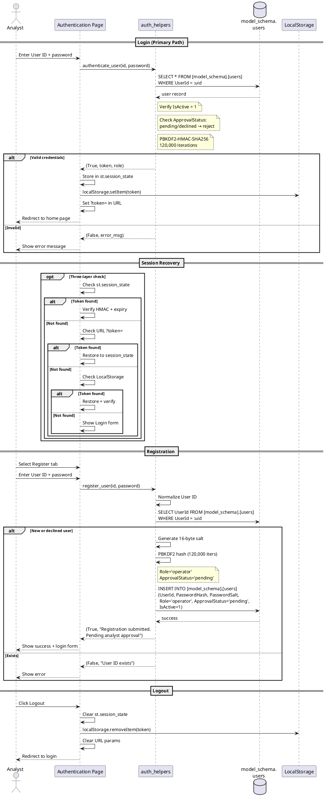

# Figure 3.8 — Authentication Sequence Diagram

**Location:** Chapter 3 — Conception / §3.2.3.1  
**Type:** UML Sequence Diagram  

---

## Purpose

Login, registration, and session recovery. The single **Analyst** actor authenticates via PBKDF2. Every other sequence diagram in the system `<<include>>`s this flow.

---

## Lifelines

| Lifeline | Type |
|----------|------|
| **Analyst** | Actor |
| **Authentication Page** | Boundary |
| **auth_helpers** | Controller |
| **model_schema.users** | Entity |
| **LocalStorage** | Storage |

---

## Flow: Login (Primary)

1. **Analyst** → **Authentication Page**: Enters User ID + password
2. **Authentication Page** → **auth_helpers**: `authenticate_user(id, password)`
3. **auth_helpers** → **model_schema.users**: `SELECT * FROM [model_schema].[users] WHERE UserId = :uid`
4. **model_schema.users** → **auth_helpers**: Returns user record
5. **auth_helpers**: Verifies `IsActive = 1`
6. **auth_helpers**: Checks `ApprovalStatus` — `'pending'` or `'declined'` → rejected
7. **auth_helpers**: `PBKDF2-HMAC-SHA256(input, stored_salt) == stored_hash` (120,000 iterations)
8. **auth_helpers**: Creates HMAC-signed token `{UserId, Role, Expires (7d), Nonce}`
8. **auth_helpers** → **Authentication Page**: `(True, token, role)`
9. **Authentication Page**: Stores in `st.session_state['auth_token']`
10. **Authentication Page** → **LocalStorage**: Stores via `localStorage.setItem()`
11. **Authentication Page**: Sets URL query param `?token=...`
12. **Authentication Page** → **Analyst**: Redirects to home

---

## Flow: Session Recovery (Alternative)

1. **Analyst**: Opens any page
2. **Page**: Calls `ensure_page_authentication(page)`
3. **Page**: Checks `st.session_state` → if valid token → proceed
4. **Page**: If not, checks URL `?token=...` → if valid → restore → proceed
5. **Page**: If not, checks `window.localStorage` → if valid → restore → proceed
6. **Page**: If no token anywhere → show Login form

---

## Flow: Registration (Alternative)

1. **Analyst** → **Authentication Page**: Selects Register tab
2. **Analyst**: Enters User ID + password
3. **Authentication Page** → **auth_helpers**: `register_user(id, password)`
4. **auth_helpers**: Normalizes User ID (lowercase trim)
5. **auth_helpers**: Checks if User ID already exists
6. `alt` [exists] → error `"User ID already exists"`
7. `alt` [new] → generates 16-byte salt → PBKDF2 hash → `INSERT INTO [model_schema].[users] (UserId, PasswordHash, PasswordSalt, Role='analyst', ApprovalStatus='approved', IsActive=1)` → success
8. **auth_helpers** → **Authentication Page**: `(True, "Account created")`
9. **Authentication Page** → **Analyst**: Displays success, shows login form

---

## Flow: Logout

1. **Analyst** → **Authentication Page**: Clicks Logout
2. **Authentication Page**: Clears `st.session_state`
3. **Authentication Page** → **LocalStorage**: `localStorage.removeItem('auth_token')`
4. **Authentication Page**: Clears URL query params
5. **Authentication Page** → **Analyst**: Redirects to login

---

## Notes for Diagram Generation

- Lifelines: **Analyst**, **Authentication Page**, **auth_helpers**, **model_schema.users**, **LocalStorage**.
- Use `alt` for: `[valid credentials]` → create session vs `[invalid]` → error.
- Use `opt` for the 3-layer session recovery loop.
- Add note: `"PBKDF2-HMAC-SHA256, 120,000 iterations"`.
- Add note: `"ApprovalStatus check: pending/declined operators are rejected"`.
- Registration creates `Role='operator'` with `ApprovalStatus='pending'` — must be approved by Analyst.
- This sequence is `<<include>>`d by all other sequence diagrams.

---

## PlantUML Code

