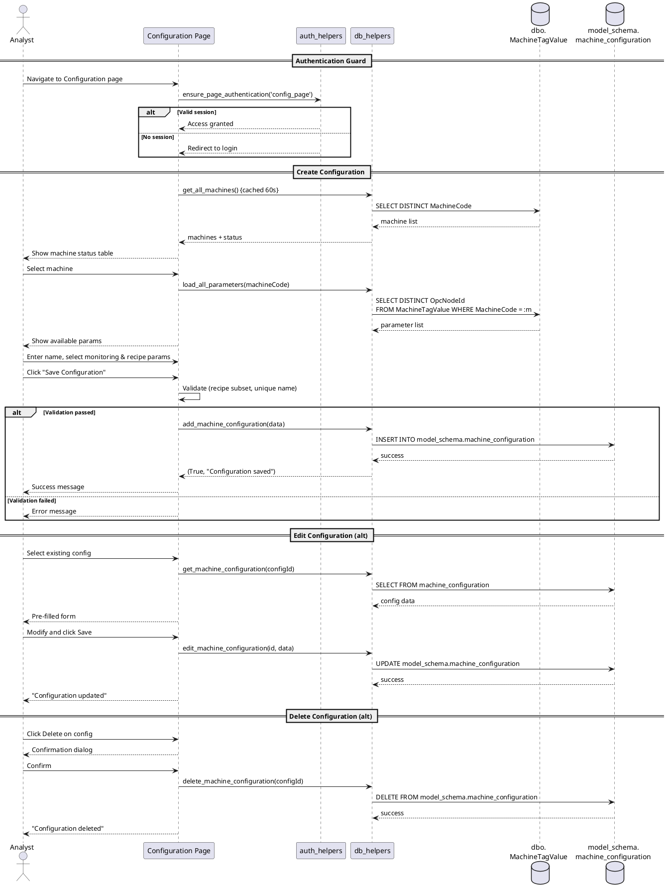

# Figure 3.9 — Machine Configuration Sequence Diagram

**Location:** Chapter 3 — Conception / §3.2.3.2 Machine Configuration  
**Type:** UML Sequence Diagram  
**Page Reference:** 30  

---

## Purpose

Model the interaction sequence when an Analyst creates or edits a machine configuration. The flow covers machine selection, parameter browsing, saving the configuration, and the authentication guard that protects the entire operation.

---

## Lifelines

| Lifeline | Type | Description |
|----------|------|-------------|
| **Analyst** | Actor | Authenticated Analyst user |
| **Configuration Page** | Boundary | Streamlit UI (`configuration_page.py`) |
| **auth_helpers** | Controller | `auth_helpers.py` — `ensure_page_authentication()` |
| **db_helpers** | Controller | `db_helpers.py` — configuration and parameter queries |
| **dbo.MachineTagValue** | Entity | Stores raw OPC UA sensor readings (MachineCode, OpcNodeId, Value, SourceTimestamp) |
| **model_schema.machine_configuration** | Entity | Stores user-defined configurations with monitoring/recipe parameters as JSON |

---

## Flow: Create Configuration

1. **Analyst** → **Configuration Page**: Navigates to Configuration page
2. **Configuration Page** → **auth_helpers**: Calls `ensure_page_authentication('configuration_page')`
3. **auth_helpers**: Verifies session token (HMAC signature + expiration + Role check)
4. **auth_helpers** → **Configuration Page**: Returns access granted (or redirects to login)
5. **Configuration Page** → **db_helpers**: Calls `get_all_machines()` (cached, TTL 60s)
6. **db_helpers** → **dbo.MachineTagValue**: `SELECT DISTINCT MachineCode FROM [dbo].[MachineTagValue]`
7. **dbo.MachineTagValue** → **db_helpers**: Returns machine list
8. **db_helpers** → **Configuration Page**: Returns machines with LineSpeed-based status
9. **Configuration Page** → **Analyst**: Displays machine status table
10. **Analyst** → **Configuration Page**: Selects a machine from dropdown
11. **Configuration Page** → **db_helpers**: Calls `load_all_parameters_for_machine(machineCode)` (cached)
12. **db_helpers** → **dbo.MachineTagValue**: `SELECT DISTINCT OpcNodeId FROM [dbo].[MachineTagValue] WHERE MachineCode = :mc`
13. **dbo.MachineTagValue** → **db_helpers**: Returns parameter list
14. **db_helpers** → **Configuration Page**: Returns available OpcNodeIds
15. **Configuration Page** → **Analyst**: Displays available parameters
16. **Analyst** → **Configuration Page**: Enters configuration name
17. **Analyst** → **Configuration Page**: Selects monitoring parameters (multi-select)
18. **Analyst** → **Configuration Page**: Designates recipe parameters (subset of monitoring)
19. **Analyst** → **Configuration Page**: Enters description (optional)
20. **Analyst** → **Configuration Page**: Clicks "Save Configuration"
21. **Configuration Page**: Validates: recipe params ⊆ monitoring params
22. **Configuration Page**: Validates: configuration name unique per machine
23. **Configuration Page** → **db_helpers**: Calls `add_machine_configuration(config_data)` — clears cache
24. **db_helpers** → **model_schema.machine_configuration**: `INSERT INTO [model_schema].[machine_configuration] (ConfigurationName, MachineCode, MonitoringParameters, RecipeParameters, Description, IsActive, CreatedAt)`
25. **model_schema.machine_configuration** → **db_helpers**: Returns success (new ConfigurationId)
26. **db_helpers** → **Configuration Page**: Returns `(True, "Configuration saved")`
27. **Configuration Page** → **Analyst**: Displays success message

---

## Flow: Edit Configuration (Alternative Path)

1. **Analyst** → **Configuration Page**: Selects existing configuration to edit
2. **Configuration Page** → **db_helpers**: Calls `get_machine_configuration(configId)`
3. **db_helpers** → **model_schema.machine_configuration**: `SELECT FROM [model_schema].[machine_configuration] WHERE ConfigurationId = :id`
4. **model_schema.machine_configuration** → **db_helpers**: Returns config data with params
5. **db_helpers** → **Configuration Page**: Returns configuration object
6. **Configuration Page** → **Analyst**: Pre-fills the form with existing values
7. **Analyst**: Modifies fields
8. **Analyst** → **Configuration Page**: Clicks "Save"
9. **Configuration Page** → **db_helpers**: Calls `edit_machine_configuration(configId, updatedData)`
10. **db_helpers** → **model_schema.machine_configuration**: `UPDATE [model_schema].[machine_configuration] SET ... WHERE ConfigurationId = :id`
11. **model_schema.machine_configuration** → **db_helpers**: Returns success
12. **db_helpers** **Configuration Page**: Returns `(True, "Configuration updated")`
13. **Configuration Page** → **Analyst**: Displays success message

---

## Flow: Delete Configuration (Alternative Path)

1. **Analyst** → **Configuration Page**: Clicks "Delete" on a configuration
2. **Configuration Page** → **Analyst**: Shows confirmation dialog
3. **Analyst** → **Configuration Page**: Confirms deletion
4. **Configuration Page** → **db_helpers**: Calls `delete_machine_configuration(configId)`
5. **db_helpers** → **model_schema.machine_configuration**: `DELETE FROM [model_schema].[machine_configuration] WHERE ConfigurationId = :id`
6. **model_schema.machine_configuration** → **db_helpers**: Returns success
7. **Configuration Page** → **Analyst**: Shows success and refreshes list

---

## Authentication Emphasis

- **Step 1–4 (authentication guard):** The very first action is `ensure_page_authentication()`. If the session is invalid, the page immediately redirects to login — no configuration data is loaded or displayed.
- **Page access:** After authentication, access is unconditionally granted to all pages (single Analyst role).
- **Session expiration:** If the session expires mid-configuration, `st.rerun()` will trigger `ensure_page_authentication()` again and redirect to login. Unsaved form data is lost.

---

## Notes for Diagram Generation

- Show **Analyst** as actor lifeline.
- Show **Configuration Page**, **auth_helpers**, **db_helpers**, **dbo.MachineTagValue**, and **model_schema.machine_configuration** as object lifelines.
- Use `alt` fragments for:
  - `alt` [session valid] → proceed vs [invalid] → redirect to login
  - `alt` [create new] → add flow vs [edit existing] → edit flow
  - `alt` [validation passed] → save vs [validation failed] → error
- Use `opt` fragment for the confirmation dialog in delete flow.
- Label cache operations with `{cached TTL 60s}` on relevant calls.
- Highlight the `ensure_page_authentication()` call as the **first interaction** on the diagram.

---

## PlantUML Code

