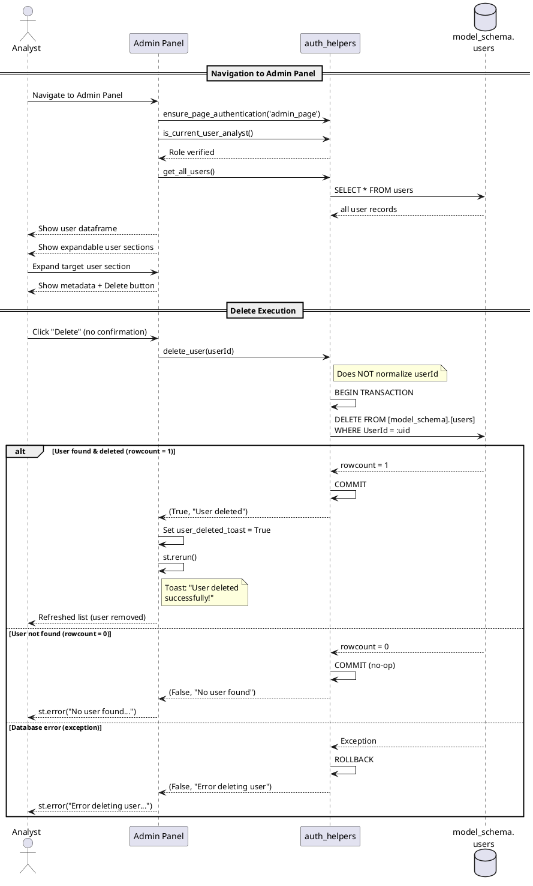

# Figure 3.X (3.2.3.8) — Delete User Sequence Diagram

**Location:** Chapter 3 — Conception / §3.2.3.8 Delete User (NEW — from Delete User Feature)  
**Type:** UML Sequence Diagram  

---

## Purpose

Model the interaction when an Analyst permanently deletes a user account via the Admin Panel. The deletion is immediate (no confirmation dialog), and uses a raw SQL DELETE statement within a transactional context.

---

## Lifelines

| Lifeline | Type | Description |
|----------|------|-------------|
| **Analyst** | Actor | Authenticated Analyst |
| **Admin Panel** | Boundary | Streamlit UI (`admin_page.py`) — Manage Page Access section |
| **auth_helpers** | Controller | `auth_helpers.py` — `delete_user()` |
| **model_schema.users** | Entity | Stores user accounts (UserId, PasswordHash, Role, IsActive) |

---

## Flow: Navigation to Delete Button

1. **Analyst** → **Admin Panel**: Navigates to Admin Panel
2. **Admin Panel** → **auth_helpers**: Calls `ensure_page_authentication('admin_page')`
3. **auth_helpers**: Verifies session token + `is_current_user_analyst()` role check
4. **Admin Panel** → **auth_helpers**: Calls `get_all_users()` to retrieve all users
5. **auth_helpers** → **model_schema.users**: `SELECT * FROM [model_schema].[users]`
6. **model_schema.users** → **auth_helpers**: Returns user list
7. **auth_helpers** → **Admin Panel**: Returns user list
8. **Admin Panel** → **Analyst**: Displays All Users dataframe
9. **Admin Panel** → **Analyst**: Displays an expandable section for each user
10. **Analyst** → **Admin Panel**: Expands a specific user section
12. **Admin Panel** → **Analyst**: Shows:
    - User metadata (User ID, Status, Active flag)
    - Delete button
    - "Save Permissions" button
    - "🚫 Disable" / "✅ Activate" toggle
    - "🗑️ Delete" button

---

## Flow: Delete Execution

13. **Analyst** → **Admin Panel**: Clicks "🗑️ Delete" button
    - **No confirmation dialog** — deletion is immediate
14. **Admin Panel** → **auth_helpers**: Calls `delete_user(operator_id)`
15. **auth_helpers**: Does NOT normalize user_id (raw input used)
16. **auth_helpers**: Begins transaction via `get_engine().begin()`
17. **auth_helpers** → **model_schema.users**: `DELETE FROM [model_schema].[users] WHERE UserId = :uid`
18. **model_schema.users**: Checks if row exists with matching UserId

```
alt [User exists and deleted]
```

19. **model_schema.users**: Deletes the row
20. **model_schema.users**: Returns `rowcount = 1`
21. **auth_helpers**: Commits transaction
22. **auth_helpers** → **Admin Panel**: Returns `(True, "User 'operator_id' has been deleted.")`

```
else [User not found]
```

23. **model_schema.users**: Returns `rowcount = 0` (no matching UserId)
24. **auth_helpers**: Commits transaction (no changes made)
25. **auth_helpers** → **Admin Panel**: Returns `(False, "No user found with User ID 'operator_id'.")`

```
else [Database error]
```

26. **model_schema.users**: Raises exception
27. **auth_helpers**: Transaction auto-rollback (via context manager)
28. **auth_helpers** → **Admin Panel**: Returns `(False, "Error deleting user: ...")`

```
end alt
```

---

## Flow: Post-Delete Response

```
alt [Success]
```

29. **Admin Panel**: Stores `st.session_state['user_deleted_toast'] = True`
30. **Admin Panel**: Calls `st.rerun()` to refresh the entire page
31. **Admin Panel**: On rerun, pops `user_deleted_toast` flag and calls `st.toast("User deleted successfully!", icon="🗑️")`
32. **Admin Panel** → **Analyst**: Shows toast notification
33. **Admin Panel** → **Analyst**: Refreshed user list — deleted user no longer appears

```
else [Failure]
```

34. **Admin Panel** → **Analyst**: Calls `st.error(msg)` with the error message
35. **Admin Panel** → **Analyst**: User list remains unchanged

```
end alt
```

---

## Authentication Emphasis

- **Dual authentication:** `ensure_page_authentication()` + `is_current_user_analyst()` — only Analysts can delete users.
- **No re-authentication required** for the delete action itself, since a valid session is already established.
- **Target:** Any user can be deleted by an Analyst (the sole role).
- **No cascading effects:** No foreign key relationships reference `model_schema.users.UserId` from any other table. Deletion is isolated to a single row.
- **Irreversible:** This is a hard-delete (no soft-delete). The record is permanently removed. No `IsActive = 0` flag is set — the row is gone.

---

## Notes for Diagram Generation

- Show **Analyst**, **Admin Panel**, **auth_helpers**, and **model_schema.users** as lifelines.
- Use `alt` fragments for:
  - `alt` [User exists] → rowcount = 1 → success toast
  - `alt` [User not found] → rowcount = 0 → error message
  - `alt` [Database error] → exception → rollback → error message
- Use another `alt` for success vs failure UI handling:
  - `alt` [Success] → toast + rerun
  - `alt` [Failure] → st.error
- Show `st.rerun()` as a self-message on Admin Panel.
- Show the transaction boundary (begin/commit/rollback) as a box covering steps 16–21/23-24/26-27.
- Add a note: "No confirmation dialog — deletion is immediate. No foreign key cascading effects."
- Highlight that `delete_user()` does NOT call `_normalize_user_id()` (unlike `register_user` and `authenticate_user`).

---

## PlantUML Code


