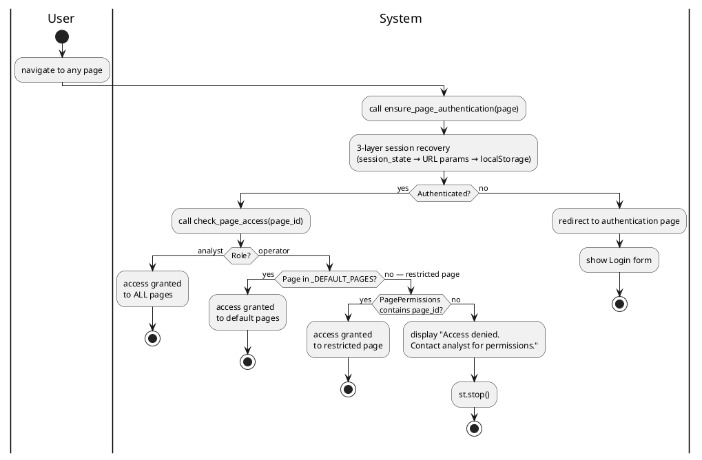

# Figure 3.X — Page Access Control Activity Diagram

**Location:** Chapter 3 — Conception / §3.2.4.6 (simplified: single Analyst role)  
**Type:** UML Activity Diagram  

---

## Purpose

Access control decision when a user navigates to any page. The system checks authentication, role (analyst vs operator), and page-level permissions for restricted pages.

---

## Swimlanes

| Lane | Actions |
|------|---------|
| **User** | Navigates to a page |
| **System** | Authentication check, role/permission check, access decision |

---

## Flow

```
[Start] → User navigates to any page
          ↓
    System calls ensure_page_authentication(page)
          ↓
    ┌─────────────────────────────────────────────────────┐
    │           3-LAYER SESSION RECOVERY                  │
    │ 1. Check st.session_state for auth_token            │
    │ 2. Check URL query params ?auth_user + ?auth_token  │
    │ 3. Check window.localStorage (via script injection)  │
    │ If all fail → redirect to Authentication page       │
    └─────────────────────────────────────────────────────┘
          ↓
         [Authenticated?]
          ↓               ↓
       [Yes]           [No]
          ↓               ↓
    ┌─────────────────┐  Redirect to
    │ check_page_     │  authentication
    │ access(page_id) │  page
    └─────────────────┘      ↓
          ↓              [End]
         [Role?]
          ↓               ↓
    [Analyst]         [Operator]
          ↓               ↓
    (grant access     [Page in
     to ALL pages)    _DEFAULT_PAGES?
          ↓           (app.py, model_page)]
          ↓              ↓          ↓
                    [Yes]      [No — restricted]
                      ↓          ↓
                 (grant     [PagePermissions
                  access)   contains page_id?]
                              ↓          ↓
                          [Yes]      [No / NULL]
                            ↓          ↓
                       (grant     "Access denied"
                        access)   st.stop()
                                     ↓
                                  [End]
```

---

## Decision Nodes

| # | Decision | Branches | Description |
|---|----------|----------|-------------|
| D1 | Authenticated? | [Yes] / [No] | After 3-layer recovery |
| D2 | Role? | [Analyst] / [Operator] | `st.session_state.auth_role` |
| D3 | Page in _DEFAULT_PAGES? | [Yes] / [No] | Default pages: app.py, model_page |
| D4 | PagePermissions contains page_id? | [Yes] / [No] | Restricted pages: configuration_page, analysis_page |

---

## Notes for Diagram Generation

- 2 swimlanes: **User**, **System**.
- Three-layer session recovery at top (session_state → URL params → localStorage).
- After authentication, `check_page_access(page_id)` determines if the user can proceed:
  - **Analysts** always have full access.
  - **Operators** can access default pages (app.py, model_page) but need explicit `PagePermissions` for restricted pages (configuration_page, analysis_page).
- If access denied, `st.stop()` halts rendering and shows an error.

---

## PlantUML Code


